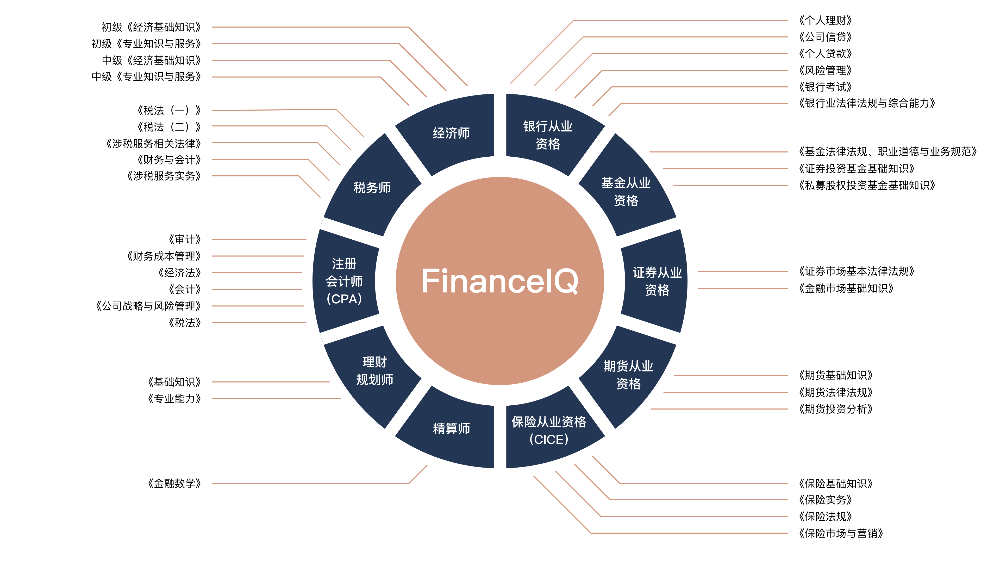

# FinanceIQ：中文金融领域知识评估基准

<p align="center" style="display: flex; flex-direction: row; justify-content: center; align-items: center">
🏆 <a href="https://github.com/Duxiaoman-DI/FinanceIQ/#排行榜" target="_blank"  style="margin-left: 10px">排行榜</a>  | 
🤗 <a href="https://huggingface.co/datasets/Duxiaoman-DI/FinanceIQ" target="_blank" style="margin-left: 10px">数据集</a> 
</p>

## 简介

FinanceIQ是一个专注于金融领域的中文评估基准，重点评估大语言模型在金融场景下的知识和推理能力。FinanceIQ涵盖了10个金融大类及36个金融小类，总计7173个单项选择题。

<p align="center">        </p>

## 金融大模型评估的核心指标

在金融行业中，目前尚未存在一套完善且统一的大模型评估标准。现有的通用评估框架，如 C-Eval 和 CMMLU，对金融领域的知识考察相对有限。因此，建立一个专门针对金融领域的评估体系势在必行。这样的体系不仅能够更精准地评估模型在金融环境中的表现，还能助力研发团队更有效地开发和调整模型，以满足金融业务的具体要求，降低实际应用的试错成本。

那么，如何制定专门针对金融行业的大模型评估体系呢？我们倡导一种综合性的评估方法，灵感来源于人力资源领域的多维度评估。具体而言，我们将这一评估过程分为三大部分：通用能力、专业知识和场景应用。

- 通用能力: 在人才选拔中，高考等大规模考试通常用于评估个体的通用能力，覆盖语言、数学、逻辑推理等多个方面。类似地，金融大模型的通用能力也应该受到充分重视。目前，国内已有一些评估基准如C-Eval和CMMLU，它们采用全类目学科考题来衡量模型的通用性。值得一提的是，这些基准正在不断优化，以适应模型开发的新动态。
- 专业知识: 除了通用能力外，专业知识是另一个关键评估因素。在金融领域，专业知识涵盖了寿险、理财、投资、信贷等多个细分领域。因此，评估标准必须包括对模型在这些专业领域内知识储备的全面评价。这是目前评估体系中的一个显著空白，也是我们需要集中关注的点。
- 场景应用: 这是一个更复杂的维度，因为它涉及模型在具体工作环境中的表现。类似于人才选拔的面试过程，场景应用能力往往需要由具体的需求方来评价。因为每个业务场景都有其独特的需求和挑战，没有单一的标准可以全面评价模型在各种场景中的适用性。事实上，由于其复杂性和多变性，更适合由具体业务需求方进行定制化评估。

因此，在构建针对金融大模型的评估体系时，我们特别注重“专业知识”这一核心因素，计划对其进行全方位和深入的评估，以确保覆盖金融行业的多个子领域。这样的专注并不意味着忽视其他评估维度，而是因为“专业知识”在目前的评估体系中存在显著的缺失，亟待我们集中解决。

## 数据来源与质量保证

我们的评测数据分为10个金融大类及36个金融小类。主要涵盖了注册会计师（CPA)、税务师、经济师、银行从业资格、基金从业资格、证券从业资格、期货从业资格、保险从业资格（CICE）、理财规划师几大权威金融领域考试。为了进一步提高评估的复杂性，我们额外选取了精算师考试中的《金融数学》科目，以此对模型处理高难度金融数学题的能力进行测试。

**题目筛选**：为了保证试题质量，FinanceIQ里面的题目大多是来源于PDF格式的文件。这些文件经过人工处理和清洗，以适应模型评估的需求。与此同时，为了确保评估结果的客观性，我们避免使用网页文本形式的试题，因为这类题目可能已被用于大模型的预训练，从而可能影响评估的准确性。

**题目改写**：为了进一步评估模型真实泛化能力，提升题目多样性，我们在不改变题目原意的前提下使用GPT4对所有精选后的原始题目的描述方式进行了改写，之后经过专业人员的仔细校对，保证题目的改写质量。同时，我们也对每道题目的四个选项均进行了随机的顺序打乱。经过这些步骤，我们实现了对原始题目的“适度改造”，使得对于参评模型来说，这是一道训练过程中“未见过”的测试题目。这样做的好处，首先可以很大程度上缓解“数据泄漏”的现象，将所有模型放在“同一起跑线”上进行客观公正地评估，其次，提升了题目的多样性，可以观察和衡量模型在金融领域知识上的泛化能力。题目改写前后的示例请见文末。

## 排行榜

我们将所有参评模型按照Base底座模型和Chat模型两类分别测评，并分别采用 five-shot 和 zero-shot 的评测方式。以下表格显示了各模型的表现。为了便于对比，我们将GPT4、ChatGPT、ErnieBot和ErnieBot-Turbo这四个API模型同时列在了两个表里。

#### Base模型（Five-Shot）

| 模型                                                                            | 平均分 | 注册会计师 | 银行从业资格 | 证券从业资格 | 基金从业资格 | 保险从业资格 | 经济师 | 税务师 | 期货从业资格 | 理财规划师 | 精算师 |
| ------------------------------------------------------------------------------- | ------ | ---------- | ------------ | ------------ | ------------ | ------------ | ------ | ------ | ------------ | ---------- | ------ |
| [XuanYuan-70B](https://huggingface.co/Duxiaoman-DI/XuanYuan-70B)                   | 67.56  | 69.49      | 76.40        | 69.56        | 74.89        | 67.82        | 84.81  | 58.40   | 71.59        | 65.15      | 37.50  |
| [GPT4](https://openai.com/gpt4) (0-shot)                                          | 60.05  | 52.33      | 68.72        | 64.8         | 68.81        | 68.68        | 75.58  | 46.93  | 63.51        | 63.84      | 27.27  |
| [ErnieBot](https://cloud.baidu.com/doc/WENXINWORKSHOP/s/jlil56u11) (0-shot)       | 55.44  | 50.8       | 64.72        | 56.38        | 60.89        | 59.48        | 74.42  | 44.26  | 56.12        | 56.68      | 30.68  |
| [Baichuan2-13B-Base](https://github.com/baichuan-inc/Baichuan2)                    | 51.2   | 45.46      | 58.88        | 50.94        | 57.8         | 54.45        | 64.81  | 42.83  | 50.81        | 53.09      | 32.95  |
| [Baichuan2-7B-Base](https://github.com/baichuan-inc/Baichuan2)                     | 47.35  | 39.36      | 54.56        | 45.58        | 52.64        | 51.01        | 60.58  | 38.52  | 49.42        | 51.14      | 30.68  |
| [Baichuan-13B-Base](https://github.com/baichuan-inc/Baichuan-13B)                  | 44.49  | 39.74      | 52.8         | 43.37        | 52.29        | 48.99        | 58.85  | 33.61  | 43.65        | 53.42      | 18.18  |
| [ChatGPT](https://openai.com/chatgpt) (0-shot)                                    | 44.2   | 34.32      | 53.12        | 44.81        | 55.05        | 49.71        | 55.19  | 31.97  | 45.27        | 49.84      | 22.73  |
| [Qwen-7B](https://github.com/QwenLM/Qwen-7B)                                       | 41.47  | 35.7       | 49.92        | 42.35        | 48.39        | 43.1         | 57.88  | 30.12  | 42.49        | 44.3       | 20.45  |
| [ErnieBot-Turbo](https://cloud.baidu.com/doc/WENXINWORKSHOP/s/4lilb2lpf) (0-shot) | 40.69  | 35.49      | 48.32        | 37.76        | 44.61        | 43.53        | 50     | 32.17  | 43.88        | 44.95      | 26.14  |
| [Chinese-LLaMA-2-13B](https://github.com/ymcui/Chinese-LLaMA-Alpaca-2)             | 38.65  | 32.04      | 43.36        | 40.82        | 42.09        | 45.11        | 50.38  | 31.35  | 40.65        | 39.09      | 21.59  |
| [Baichuan-7B](https://github.com/baichuan-inc/baichuan-7B)                         | 37.14  | 30.89      | 41.12        | 39.12        | 41.51        | 41.24        | 45.38  | 28.89  | 39.95        | 41.69      | 21.59  |
| [LLaMA-2-13B](https://huggingface.co/meta-llama/Llama-2-13b-hf)                    | 35.09  | 32.72      | 37.6         | 37.59        | 39.68        | 37.93        | 41.15  | 27.05  | 36.03        | 38.44      | 22.73  |
| [InternLM-7B](https://huggingface.co/internlm/internlm-7b)                         | 33.91  | 27.61      | 40           | 35.12        | 33.14        | 34.34        | 36.35  | 29.71  | 34.64        | 37.46      | 30.68  |
| [LLaMA-2-7B](https://huggingface.co/meta-llama/Llama-2-7b-hf)                      | 31.49  | 28.3       | 31.6         | 34.44        | 32.34        | 34.63        | 35.58  | 25.82  | 30.25        | 26.71      | 35.23  |
| [Chinese-LLaMA-2-7B](https://github.com/ymcui/Chinese-LLaMA-Alpaca-2)              | 30.82  | 28.76      | 32.64        | 36.05        | 32.8         | 32.76        | 38.08  | 22.95  | 35.33        | 28.34      | 20.45  |

#### Chat模型（Zero-Shot）

| 模型                                                                    | 平均分 | 注册会计师 | 银行从业资格 | 证券从业资格 | 基金从业资格 | 保险从业资格 | 经济师 | 税务师 | 期货从业资格 | 理财规划师 | 精算师 |
| ----------------------------------------------------------------------- | ------ | ---------- | ------------ | ------------ | ------------ | ------------ | ------ | ------ | ------------ | ---------- | ------ |
| [XuanYuan-70B-Chat](https://huggingface.co/Duxiaoman-DI/XuanYuan-70B-Chat) | -      | -          | -            | -            | -            | -            | -      | -      | -            | -          | -      |
| [GPT4](https://openai.com/gpt4)                                            | 60.05  | 52.33      | 68.72        | 64.8         | 68.81        | 68.68        | 75.58  | 46.93  | 63.51        | 63.84      | 27.27  |
| [ErnieBot](https://cloud.baidu.com/doc/WENXINWORKSHOP/s/jlil56u11)         | 55.44  | 50.8       | 64.72        | 56.38        | 60.89        | 59.48        | 74.42  | 44.26  | 56.12        | 56.68      | 30.68  |
| [Baichuan2-13B-Chat](https://github.com/baichuan-inc/Baichuan2)            | 47.59  | 40.88      | 56.56        | 51.79        | 53.9         | 52.73        | 59.04  | 37.7   | 48.96        | 50.49      | 23.86  |
| [Qwen-7B-Chat](https://github.com/QwenLM/Qwen-7B)                          | 46.72  | 37.6       | 56.4         | 47.19        | 54.13        | 49.71        | 56.73  | 36.07  | 49.65        | 52.44      | 27.27  |
| [Baichuan2-7B-Chat](https://github.com/baichuan-inc/Baichuan2)             | 44.84  | 36.08      | 51.68        | 46           | 51.72        | 48.42        | 54.42  | 41.19  | 47.11        | 50.16      | 21.59  |
| [ChatGPT](https://openai.com/chatgpt)                                      | 44.2   | 34.32      | 53.12        | 44.81        | 55.05        | 49.71        | 55.19  | 31.97  | 45.27        | 49.84      | 22.73  |
| [Baichuan-13B-Chat](https://github.com/baichuan-inc/Baichuan-13B)          | 43.63  | 38.22      | 52.32        | 44.64        | 48.51        | 50           | 55.58  | 33.81  | 44.57        | 48.21      | 20.45  |
| [ChatGLM2-6B](https://github.com/THUDM/ChatGLM2-6B)                        | 43.26  | 35.93      | 52.88        | 48.3         | 50.69        | 49.86        | 50.77  | 34.02  | 42.96        | 45.6       | 21.59  |
| [InternLM-7B-Chat](https://huggingface.co/internlm/internlm-7b)            | 43.23  | 36         | 51.44        | 45.75        | 49.31        | 51.01        | 56.35  | 34.43  | 42.49        | 43.97      | 21.59  |
| [Chinese-Alpaca-2-13B](https://github.com/ymcui/Chinese-LLaMA-Alpaca-2)    | 41.52  | 31.66      | 47.04        | 42.35        | 49.08        | 45.26        | 48.85  | 32.79  | 43.65        | 42.67      | 31.82  |
| [ErnieBot-Turbo](https://cloud.baidu.com/doc/WENXINWORKSHOP/s/4lilb2lpf)   | 40.69  | 35.49      | 48.32        | 37.76        | 44.61        | 43.53        | 50     | 32.17  | 43.88        | 44.95      | 26.14  |
| [Chinese-Alpaca-2-7B](https://github.com/ymcui/Chinese-LLaMA-Alpaca-2)     | 40.69  | 35.49      | 48.32        | 37.76        | 44.61        | 43.53        | 50     | 32.17  | 43.88        | 44.95      | 26.14  |
| [ChatGLM-6B](https://github.com/THUDM/ChatGLM-6B)                          | 36.16  | 32.65      | 40.72        | 37.16        | 35.89        | 39.8         | 41.54  | 29.1   | 35.8         | 37.13      | 31.82  |
| [LLaMA-2-13B-Chat](https://huggingface.co/meta-llama/Llama-2-13b-chat-hf)  | 35.76  | 30.66      | 37.6         | 36.99        | 38.88        | 40.09        | 41.35  | 30.53  | 37.64        | 33.22      | 30.68  |
| [LLaMA-2-7B-Chat](https://huggingface.co/meta-llama/Llama-2-7b-chat-hf)    | 32.19  | 28.15      | 32.96        | 33.59        | 33.37        | 33.48        | 33.46  | 25.41  | 32.1         | 34.2       | 35.23  |

## 数据

我们根据每个金融大类在 `data`目录中提供了dev和test数据集，其中dev用于构建few-shot，test为正式的测试题目。数据集中的每个问题都是一个四选项的单选题，有且只有一个正确选项。您也可以通过[Hugging Face](https://huggingface.co/datasets/Duxiaoman-DI/FinanceIQ)获取我们的数据。题目示例如下：

| Question                                                                                                                                                                         | A                                          | B                                  | C                              | D                              | Answer |
| -------------------------------------------------------------------------------------------------------------------------------------------------------------------------------- | ------------------------------------------ | ---------------------------------- | ------------------------------ | ------------------------------ | ------ |
| 作为一种重要的金融机构，中央银行在代表其所在国家政府发行国家法币，制定及执行货币政策，以及实施金融监管方面发挥着关键作用。当中央银行充作为券发行的主体时，以下哪种陈述是正确的？ | 可以发行股票，但不可以发行债券             | 既不可以发行股票，也不可以发行债券 | 既可以发行股票，也可以发行债券 | 不可以发行股票，但可以发行债券 | C      |
| 主要对哪些对象进行债券信用评级？                                                                                                                                                 | 发行的地方政府或非国家金融机构所有有价证券 | 发行的企业债券                     | 发行的国家财政国库券           | 发行的国家银行金融债券         | B      |

## 评估方式

评测代码是在[CMMLU](https://github.com/haonan-li/CMMLU)的基础上进行了一定程度的改进和适配。所有待测试模型的评估代码位于 `src`目录下，启动脚本位于 `script`目录下，并在 `src/utils.py`文件中提供了预处理代码，包括few-shot和zero-shot的实现方式。值得注意的是，为了贴近真实的使用场景，我们选择使用模型生成的完整回答文本提取选项后计算正确率的方案，并未采用取logits中“A”、“B”、“C”、“D”字符概率最高的评测方案。

#### Zero-Shot示例

```
以下是关于理财规划师的单项选择题，请直接给出正确答案的选项。

题目：财务分析有几种基础方法。其中，有一种是通过把某一复杂的经济指标拆分为一些有内在关系的因子，并进一步计算这些因子对该综合经济指标变动的影响程度。你觉得这是哪一种分析方法？
A. 比较分析法
B. 连环替代法
C. 百分比分析法
D. 趋势分析法
答案是：
```

#### Few-Shot示例（5-shot）

```
以下是关于理财规划师的单项选择题，请直接给出正确答案的选项。

题目：在税收法律关系中，权利和义务共同指向的对象是什么？
A. 权利客体
B. 法律关系内容
C. 征税内容
D. 权利主体
答案是：A

题目：以下关于《关于完善企业职工基本养老保险制度的决定》的十大主要任务的表述，哪项是不正确的？该决定于2005年12月由国务院发布。
A. 逐步做实个人账户，真正实现由部分积累制向现收现付制的转变
B. 继续确保基本养老金按时足额发放
C. 积极发展企业年金，建立多层次的养老保险体制
D. 改革基本养老金计发办法，建立参保缴费的激励约束机制
答案是：A

题目：请根据以下描述选择正确答案：在使用直接标价法时，如果在兑换固定单位外币时结果得到的本国货币数量增加，那么这似乎表明了本币汇率的什么情况？
A. 上升
B. 不变
C. 不确定
D. 下降
答案是：D

题目：通常来说，如果财政部门开始实施结余政策以及减少财政支出，它们的目标最可能是什么呢？
A. 调整资金供需以及货币的流通量
B. 向证券市场转移资金
C. 减少社会总需求
D. 调整各个地区之间的财力分配
答案是：C

题目：在进行现金规划时，我们经常需要参考流动性比率这一关键指标，那么，这个比率一般应维持在（）左右。
A. 2
B. 3
C. 10
D. 1
答案是：B

题目：财务分析有几种基础方法。其中，有一种是通过把某一复杂的经济指标拆分为一些有内在关系的因子，并进一步计算这些因子对该综合经济指标变动的影响程度。你觉得这是哪一种分析方法？
A. 比较分析法
B. 连环替代法
C. 百分比分析法
D. 趋势分析法
答案是：
```

### 题目改写示例

| 题目类别     | 原题                                                                                                                                                                                                                                                                                                                                                                                                                         | 原题答案 | 改写题                                                                                                                                                                                                                                                                                                                                                                                                                                                                                                       | 改写题答案 |
| ------------ | ---------------------------------------------------------------------------------------------------------------------------------------------------------------------------------------------------------------------------------------------------------------------------------------------------------------------------------------------------------------------------------------------------------------------------- | -------- | ------------------------------------------------------------------------------------------------------------------------------------------------------------------------------------------------------------------------------------------------------------------------------------------------------------------------------------------------------------------------------------------------------------------------------------------------------------------------------------------------------------ | ---------- |
| 理财规划师   | 下列关于等额本息还款法、等额本金还款法两种还款方式的说法，错误的是（）。<br /> A. 两种还款方式相比，在全期还款的条件下，“等额本息还款法”所要支付的利息将高于“等额本金还款法”<br />B. 对于高薪者或收入多元化的客户，采用“等额本金还款法” <br />C. 如果客户现在的资金较为雄厚，又不打算提前还款，建议采用“等额本息还款法”还贷<br />D. 如果客户是一位公务员或者是一位工作四平八稳的上班族，建议选择“等额本息还款法”   | C        | 在以下关于两种还款方法——等额本息还款法和等额本金还款法——的描述中，以下哪一个陈述是不正确的？<br />A. 如果客户有充裕的资金，并且没有提前偿还贷款的计划，那么建议选择“等额本息还款法" <br />B. 当以全期偿还的条件比较两种支付方式时，“等额本息还款法”需支付的利息额度会超过“等额本金还款法” <br />C. 对于货币来源多样或者有高收入的客户，推荐采用“等额本金还款法” <br />D. 如果客户是公务员或者工作稳定的职员，那么建议选择“等额本息还款法”                                                       | A          |
| 保险从业资格 | 现代保险中的最大诚信原则最早起源于（）。<br />A. 人寿保险 <br />B. 健康保险 <br />C. 海上保险 <br />D. 财产保险                                                                                                                                                                                                                                                                                                              | C        | 在现代保险界，最大诚信原则的源头最初是哪一种保险呢？<br />A. 人寿保险 <br />B. 健康保险 <br />C. 财产保险 <br />D. 海上保险                                                                                                                                                                                                                                                                                                                                                                                  | D          |
| 保险从业资格 | 2009年12月1日，甲让女儿乙在江中冬泳时乘人不注意，偷偷潜入水中游到别的地方躲藏起来。紧接着甲故意沿江边大张旗鼓地寻找乙，造成乙溺水身亡的假象。然后，甲以受益人身份向保险公司索赔。保险公司根据甲的邻居举报找到了乙的藏身地。下列说法正确的是（）。<br />A. 保险公司可以解除合同并退还保费<br />B. 保险公司可以解除合同并不退还保费<br />C. 保险公司可以解除合同但应退还现金价值 <br />D. 保险公司不得解除合同，但可以增加保费 | B        | 在2009年的12月1日，甲让他的女儿乙在河中做冬泳，然后趁着别人不注意偷偷游到别处，并一直藏在那里。随后，甲在沿江边煞有介事的寻找女儿，形成一种就像乙已经溺水死亡的假象。然后甲作为受益人向保险公司提出理赔。但是因为邻居的举报，保险公司找到了乙的藏身之处。请问，以下哪种情况是正确的？<br />A. 保险公司有权解除合同，但并不需要退还已支付的保费 <br />B. 保险公司不能解除合同，可以向甲增收保费 <br />C. 保险公司有权解除合同并退还甲已支付的保费 <br />D. 保险公司有权解除合同，但应将合同的现金价值退还给甲 | A          |
| 基金从业资格 | 关于基金与银行储蓄存款的差异，以下表述正确的是（）。<br />Ⅰ.性质不同 <br />Ⅱ.收益不同 <br />Ⅲ.风险特征不同 <br />Ⅳ.信息披露程度不同 <br /><br />A. Ⅰ.Ⅱ.Ⅲ.Ⅳ<br />B. Ⅱ.Ⅲ.Ⅳ<br />C. Ⅰ.Ⅱ.Ⅲ<br />D. Ⅰ.Ⅲ                                                                                                                                                                                                           | A        | 请依据以下四项内容选择与基金和银行储蓄存款的差异相关的正确描述（）。<br />Ⅰ.它们的性质并不相同 <br />Ⅱ.它们存在收益上的差异 <br />Ⅲ.它们的风险特征有所不同 <br />Ⅳ.两者在信息披露程度上有区别 <br /><br />A. Ⅰ.Ⅲ<br />B. Ⅱ.Ⅲ.Ⅳ<br />C. Ⅰ.Ⅱ.Ⅲ<br />D. Ⅰ.Ⅱ.Ⅲ.Ⅳ                                                                                                                                                                                                                                 | D          |

## 致谢

- 在此致谢[CMMLU](https://github.com/haonan-li/CMMLU)为开源评测所作的工作。

## License

FinanceIQ评估数据集采用[Creative Commons Attribution-NonCommercial-ShareAlike 4.0 International License](http://creativecommons.org/licenses/by-nc-sa/4.0/).
