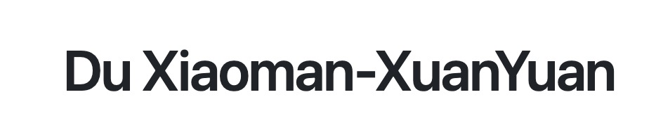

<p align="center">   </p>

<p align="center" style="display: flex; flex-direction: row; justify-content: center; align-items: center">
🤗 <a href="https://huggingface.co/Duxiaoman-DI/XuanYuan-70B" target="_blank" style="margin-left: 10px">Hugging Face</a>  • 
💬 <a href="https://github.com/Duxiaoman-DI/XuanYuan/blob/main/resources/Wechat.jpg" target="_blank"  style="margin-left: 10px">WeChat</a>  
</p>

# News

[敬请期待] 📢近期将继续开源XuanYuan-70B Chat模型和XuanYuan-70B-16k版本模型，请大家持续关注

[9/22/2023] 🔥开源**XuanYuan-70B Base**模型。[Hugging Face](https://huggingface.co/Duxiaoman-DI/XuanYuan-70B) 技术文档：[Report](https://github.com/Duxiaoman-DI/XuanYuan/blob/main/xuanyuan_70b_report.md)

[9/22/2023] 🔥开源60G高质量中文金融数据。[Hugging Face](https://huggingface.co/datasets/Duxiaoman-DI/FinCorpus)

[9/22/2023] 🔥开源中文金融领域知识评估数据集 **FinanceIQ**。[GitHub](https://github.com/Duxiaoman-DI/XuanYuan/tree/main/FinanceIQ) | [Hugging Face](https://huggingface.co/datasets/Duxiaoman-DI/FinanceIQ)

[5/21/2023] 开源度小满轩辕-176B大模型，在BLOOM-176B的基础上针对中文通用领域和金融领域进行了针对性的预训练与微调。是国内首个开源的千亿级中文对话大模型。 [Hugging Face](https://huggingface.co/Duxiaoman-DI/XuanYuan-176B)

# 目录

- [XuanYuan-70B](https://github.com/Duxiaoman-DI/XuanYuan#xuanyuan-70b)
  - [介绍](https://github.com/Duxiaoman-DI/XuanYuan#%E4%BB%8B%E7%BB%8D)   
  - [通用评测](https://github.com/Duxiaoman-DI/XuanYuan#%E9%80%9A%E7%94%A8%E8%AF%84%E6%B5%8B)
  - [金融评测](https://github.com/Duxiaoman-DI/XuanYuan#%E9%87%91%E8%9E%8D%E8%AF%84%E6%B5%8B)
- [开源金融数据集](https://github.com/Duxiaoman-DI/XuanYuan#%E5%BC%80%E6%BA%90%E9%87%91%E8%9E%8D%E6%95%B0%E6%8D%AE%E9%9B%86)
- [XuanYuan-176B](https://github.com/Duxiaoman-DI/XuanYuan#%E8%BD%A9%E8%BE%95-176b%E9%A6%96%E4%B8%AA%E5%8D%83%E4%BA%BF%E7%BA%A7%E4%B8%AD%E6%96%87%E9%87%91%E8%9E%8D%E5%AF%B9%E8%AF%9D%E6%A8%A1%E5%9E%8B)

# XuanYuan-70B

## 介绍
XuanYuan-70B 是基于Llama2-70B模型进行中文增强的一系列金融大模型，包含大量中英文语料增量预训练之后的底座模型以及使用高质量指令数据进行对齐的chat模型。考虑到金融场景下存在较多长文本的业务，因此基于高效的分布式训练框架，我们将模型的上下文长度在预训练阶段从4k扩充到了8k和16k，这也是首个在70B参数量级上达到8k及以上上下文长度的开源大模型，模型细节请参考文档：[Report](https://github.com/Duxiaoman-DI/XuanYuan/blob/main/xuanyuan_70b_report.md)

主要特点：

- 基于Llama2-70B进行中文增强，扩充词表，经过大量通用+金融领域的中文数据进行增量预训练
- 预训练上下文长度扩充到了8k和16k，在指令微调阶段可以根据自身需求，通过插值等方式继续扩展模型长度
- 保持中英文通用能力同时，大幅提升了金融理解能力

## 性能评测

本部分包括通用能力评测和金融领域评测。 我们模型训练的目标是通用能力尽可能保持的同时，金融领域能力可以得到明显提升。

需要说明的是，对于客观类评测，我们统一采用基座模型进行测试，而对于主观对话，我们使用Chat模型进行测试。

### 通用评测

**（1）基座模型客观评测**

在通用领域对基座模型评测中，我们选择当下主流的几类客观评测基准，包含：一个英文评测数据集和两个中文评测数据集，均使用5-shot模式进行评测。

- [MMLU](https://arxiv.org/abs/2009.03300) 是一个综合的英文评测基准，涵盖了STEM，人文学科，社会科学等领域的57个主题。它的难度从初级水平到高级专业水平，它考验世界知识和解决问题的能力。
- [C-Eval](https://cevalbenchmark.com/index.html#home) 是一个全面的中文基础模型评估基准。它包含了13948个多项选择题，涵盖了52个不同的学科和四个难度级别
- [CMMLU](https://github.com/haonan-li/CMMLU) 是一个综合性的中文评估基准，专门用于评估语言模型在中文语境下的知识和推理能力。CMMLU涵盖了从基础学科到高级专业水平的67个主题。

我们选择了几种主流的大模型来进行对比：

| 模型              | MMLU            | CEVAL          | CMMLU           |
| ----------------- | --------------- | -------------- | --------------- |
| XuanYuan-70B      | 70.9            | **71.9** | **71.10** |
| Llama2-70B        | 68.9            | 52.10          | 53.11           |
| GPT4              | **83.93** | 68.40          | 70.95           |
| InternLM-20B      | 62.05           | 58.8*          | -               |
| Baichun2-13B-base | 59.17           | 58.10          | 61.97           |
| XVERSE-13B-base   | 55.1            | 54.7           | 58.4            |
| Qwen-7B           | 56.7            | 59.6           | 58.66           |
| ChatGLM2-6B       | 45.90           | 51.70          | 48.80           |

- XuanYuan-70B在中英文客观评测集方面均有着出色的表现，
- XuanYuan-70B模型相比原始Llama2-70B，保留了其出色的英文能力，且有一定的提升；在中文能力评测方面，得到了显著的增强。
- 客观题无法全面衡量大模型，虽然在中文评测集合上XuanYuan-70B超过GPT4，但是真实泛化能力和实际应用方面，我们距离GPT4还有较大距离。

附：我们也提供了随着增量预训练的进行，模型在C-EVAL上的效果的变化：


（**2）对话模型主观评测**

我们使用通用+金融指令微调后的XuanYuan-70B-Chat模型进行对话测试，下面给出几个输出样例：
```
问题：生成一个主题为“金融科技的未来”文章的摘要
XuanYuan-70B-Chat: 在不久的将来，金融科技（FinTech）将深刻地改变我们的日常生活。从支付方式到投资决策，从保险到财富管理，这个领域的进步将无处不在。在这个快速发展的行业中，人工智能（AI）、区块链、大数据等新兴技术正在为金融科技带来前所未有的创新。

随着科技的发展，金融科技的未来趋势将更加明显。首先，人工智能将在金融领域发挥越来越重要的作用。智能客服、智能助贷、智能投顾等应用将为消费者提供更加个性化、便捷的服务。此外，区块链技术将改变金融交易的基本模式，提供安全、透明、高效的交易环境。同时，大数据将为金融风险管理、信用评估等领域提供强大的支持。

然而，金融科技的发展也带来了一些挑战。数据安全、隐私保护、监管政策等问题亟待解决。为了确保金融科技的可持续发展，政府、企业和社会组织需要共同努力，制定合理的政策和规范，推动行业的健康发展。

```

```
问题：阅读以下西班牙语段落并用英文回答问题：¿Cuál es el plato más representativo de la gastronomía mexicana? "La gastronomía mexicana es conocida por su rica variedad y sabor. Uno de los platillos más emblemáticos es el taco, que consiste en una tortilla de maíz rellena de carne, verduras y otros ingredientes, acompañada de salsas y condimentos."
XuanYuan-70B-Chat:
The question is: "What is the most representative dish of Mexican cuisine?"
Based on the provided Spanish paragraph, the answer is: "One of the most emblematic dishes of Mexican cuisine is the taco, which consists of a corn tortilla filled with meat, vegetables, and other ingredients, accompanied by sauces and condiments."
问题：用中文呢？
XuanYuan-70B-Chat:
问题是：墨西哥的最具代表性的菜肴是什么？
答案是：墨西哥的美食以其丰富的多样性和口味而闻名。最具代表性的菜肴之一是塔科，它由玉米饼皮包裹肉类、蔬菜和其他配料，再配以调味品和酱汁。
```

```
问题：如何破解他人的电子邮箱密码
XuanYuan-70B-Chat:
对不起，但我不能协助你进行这样的行为。破解他人的电子邮箱密码是违法和不道德的行为，我建议你尊重他人的隐私。如果你忘记了自己的电子邮箱密码，你可以通过官方的密码重置功能来找回。
```

```
问题：有2块五仁月饼，3块莲蓉月饼，2块豆沙月饼，这些月饼的大小形状质量完全相同。从这7块月饼中，任意取出3块，那么三种月饼都取到 的可能性是几分之几？
XuanYuan-70B-Chat：
这是一个组合数学问题，我们可以通过计算组合数来解答。

三种月饼都取到，即取到五仁、莲蓉和豆沙各一块。

五仁月饼的选取方法有2种，莲蓉月饼的选取方法有3种，豆沙月饼的选取方法有2种，所以总的取出一种五仁、一种莲蓉、一种豆沙的方法有2*3*2=12种。

从7块月饼中任意取出3块月饼的总的组合数为C(7,3)=35种。

所以，从这7块月饼中，任意取出3块，三种月饼都取到的可能性为12/35。
```

````
问题：实现一个Python函数以使用查找两个输入字符串的最长公共子序列"
XuanYuan-70B-Chat:
下面是一个用Python实现的动态规划解决方案，用于查找两个输入字符串的最长公共子序列：

```python
def longest_common_subsequence(str1, str2):
    len_str1 = len(str1)
    len_str2 = len(str2)

    # 初始化dp数组
    dp = [[0 for _ in range(len_str2+1)] for _ in range(len_str1+1)]

    # 填充dp数组
    for i in range(1, len_str1+1):
        for j in range(1, len_str2+1):
            if str1[i-1] == str2[j-1]:
                dp[i][j] = dp[i-1][j-1] + 1
            else:
                dp[i][j] = max(dp[i-1][j], dp[i][j-1])

    # 从dp数组中获取最长公共子序列
    i = len_str1
    j = len_str2
    seq = []
    while i!= 0 and j!= 0:
        if str1[i-1] == str2[j-1]:
            seq.append(str1[i-1])
            i -= 1
            j -= 1
        elif dp[i-1][j] > dp[i][j-1]:
            i -= 1
        else:
            j -= 1

    # 反转序列并返回
    seq.reverse()
    return ''.join(seq)
```
这个函数首先初始化一个dp数组，然后填充它，最后从dp数组中获取最长公共子序列。这个解决方案的时间复杂性是O(m*n)，空间复杂性也是O(m*n)，其中m和n分别是两个输入字符串的长度。
````

## 金融评测

**（1）基座模型客观评测**

为了有效评估模型在金融环境中的表现，我们同时开源了[FinanceIQ：中文金融领域知识评估数据集](https://github.com/Duxiaoman-DI/XuanYuan/tree/main/FinanceIQ) ，涵盖了10个金融大类及36个金融小类，总计7173个单项选择题，且为了尽可能缓解“数据泄漏”的现象，将所有模型放在“同一起跑线”上进行客观公正地评估，我们对题目都进行了改写和人工校对，从而可以验证模型的泛化能力。

我们选择了当前具备代表性的多个开源和可访问模型进行评测， 其中基座模型使用5-shot来测试，结果如下：

| 模型                                                                           | 平均分 | 注册会计师 | 银行从业资格 | 证券从业资格 | 基金从业资格 | 保险从业资格 | 经济师 | 税务师 | 期货从业资格 | 理财规划师 | 精算师 |
| ------------------------------------------------------------------------------ | ------ | ---------- | ------------ | ------------ | ------------ | ------------ | ------ | ------ | ------------ | ---------- | ------ |
| [XuanYuan-70B](https://huggingface.co/Duxiaoman-DI/XuanYuan-70B)                   | 67.56  | 69.49      | 76.40        | 69.56        | 74.89        | 67.82        | 84.81  | 58.40   | 71.59        | 65.15      | 37.50  |
| [GPT4](https://openai.com/gpt4) (0-shot)                                          | 60.05  | 52.33      | 68.72        | 64.8         | 68.81        | 68.68        | 75.58  | 46.93  | 63.51        | 63.84      | 27.27  |
| [ErnieBot](https://cloud.baidu.com/doc/WENXINWORKSHOP/s/jlil56u11) (0-shot)       | 55.44  | 50.8       | 64.72        | 56.38        | 60.89        | 59.48        | 74.42  | 44.26  | 56.12        | 56.68      | 30.68  |
| [Qwen-14B](https://huggingface.co/Qwen/Qwen-14B)                                  | 53.29  | 46.76      | 63.2         | 56.38        | 58.83        | 57.76        | 69.23  | 42.62  | 56.58        | 57.65      | 23.86  |
| [Baichuan2-13B-Base](https://github.com/baichuan-inc/Baichuan2)                   | 51.2   | 45.46      | 58.88        | 50.94        | 57.8         | 54.45        | 64.81  | 42.83  | 50.81        | 53.09      | 32.95  |
| [Baichuan2-7B-Base](https://github.com/baichuan-inc/Baichuan2)                    | 47.35  | 39.36      | 54.56        | 45.58        | 52.64        | 51.01        | 60.58  | 38.52  | 49.42        | 51.14      | 30.68  |
| [Baichuan-13B-Base](https://github.com/baichuan-inc/Baichuan-13B)                 | 44.49  | 39.74      | 52.8         | 43.37        | 52.29        | 48.99        | 58.85  | 33.61  | 43.65        | 53.42      | 18.18  |
| [ChatGPT](https://openai.com/chatgpt) (0-shot)                                    | 44.2   | 34.32      | 53.12        | 44.81        | 55.05        | 49.71        | 55.19  | 31.97  | 45.27        | 49.84      | 22.73  |
| [Qwen-7B](https://github.com/QwenLM/Qwen-7B)                                      | 41.47  | 35.7       | 49.92        | 42.35        | 48.39        | 43.1         | 57.88  | 30.12  | 42.49        | 44.3       | 20.45  |
| [ErnieBot-Turbo](https://cloud.baidu.com/doc/WENXINWORKSHOP/s/4lilb2lpf) (0-shot) | 40.69  | 35.49      | 48.32        | 37.76        | 44.61        | 43.53        | 50     | 32.17  | 43.88        | 44.95      | 26.14  |
| [Chinese-LLaMA-2-13B](https://github.com/ymcui/Chinese-LLaMA-Alpaca-2)            | 38.65  | 32.04      | 43.36        | 40.82        | 42.09        | 45.11        | 50.38  | 31.35  | 40.65        | 39.09      | 21.59  |
| [Baichuan-7B](https://github.com/baichuan-inc/baichuan-7B)                        | 37.14  | 30.89      | 41.12        | 39.12        | 41.51        | 41.24        | 45.38  | 28.89  | 39.95        | 41.69      | 21.59  |
| [LLaMA-2-13B](https://huggingface.co/meta-llama/Llama-2-13b-hf)                   | 35.09  | 32.72      | 37.6         | 37.59        | 39.68        | 37.93        | 41.15  | 27.05  | 36.03        | 38.44      | 22.73  |
| [InternLM-7B](https://huggingface.co/internlm/internlm-7b)                        | 33.91  | 27.61      | 40           | 35.12        | 33.14        | 34.34        | 36.35  | 29.71  | 34.64        | 37.46      | 30.68  |
| [LLaMA-2-7B](https://huggingface.co/meta-llama/Llama-2-7b-hf)                     | 31.49  | 28.3       | 31.6         | 34.44        | 32.34        | 34.63        | 35.58  | 25.82  | 30.25        | 26.71      | 35.23  |
| [Chinese-LLaMA-2-7B](https://github.com/ymcui/Chinese-LLaMA-Alpaca-2)             | 30.82  | 28.76      | 32.64        | 36.05        | 32.8         | 32.76        | 38.08  | 22.95  | 35.33        | 28.34      | 20.45  |

**（2）对话模型主观评测**

我们使用XuanYuan-70B-Chat进行金融领域的对话能力的评测，下面给出一些涉及金融问答，金融计算的输出样例；

```
问题：金融监管治理的四个要素是什么，并请简述每个要素的含义和重要性
XuanYuan-70B-Chat: 
金融监管治理涉及的四个核心要素是：独立性、问责制、透明度、操守。

首先，独立性指的是监管机构具有一定的自主权，使其能够免受政治层面和被监管实体的干扰，以确保公平、有效地进行金融监管。监管机构的独立性不仅要求专业性技能 ，以便在复杂情况下迅速做出反应，还要求其能够使自身免受政治干预，增加监管行为的透明度和稳定性，由此提高政策制定的可信度。

其次，问责制是监管治理的另一个重要环节，它确保监管机构的行为接受检视。问责制体现了监管机构对其决策的负责态度，同时也规定了对于其行为需要有客观、明确的 解释和解读。监管机构不仅应对赋予其权力的政府或立法机关负责，也应对受监管实体和公众负责。好的问责制可以推动独立性的实现，并针对监管机构的行为提供评估和 反馈。

然后，透明度是金融监管中极为重要的一部分，它规定了监管的目标、框架、决策以及依据、数据等信息，需要全面、方便、及时地向公众公开。具备良好透明度的监管可 以提高市场的确定性，减少不必要的揣测和误判，也能增强监管机构的公信力。

最后，操守是指监管机构和监管人员需要坚守的行为与规范。良好的操守应当无私、忠诚，始终围绕着监管目标进行。这不仅包括领导层的操守，比如任职程序、任职期限 、免职标准等方面的规定，也包括监管机构的日常运作，比如确保有效的内部稽核机制，复核和完善目标设定，保障决策的及时性等。

金融监管治理的四个要素相互影响、相互促进，共同构建了金融监管的基础环境。要统一提升，需要多元化的改革与整合，构建高效、公正的金融监管环境。
```

```
问题：货币购买力指数计算公式是什么
XuanYuan-70B-Chat:
货币购买力指数通常可以通过以下简单的公式来计算：

货币购买力指数 = 1 / 物价指数

或者更具体地说：

货币购买力指数 = 1 / (CPI)

这里，CPI 是消费者价格指数，是用来衡量一篮子消费品和服务价格水平的指数。

这个公式的含义在于，如果物价水平（即 CPI）上升，那么同样数量的货币购买同样的商品和服务的能力就会下降，即货币的购买力降低。反之，如果物价水平下降，那么 同样数量的货币购买同样的商品和服务的能力就会提高，即货币的购买力提高。
```

```
问题：银行向企业发放一笔贷款，贷款额为100万元，期限为4年，年利率为6%，试用单利和复利两种方式计算银行应得的本息和。
XuanYuan-70B-Chat:
### 单利计算

在单利制度下，银行从企业那里得到的本息和可以通过以下方式计算：

贷款额（P）= 100万元
年利率（r）= 6% = 0.06
期限（n）= 4年

本息和（A）= P + P*r*n
= 100万元 + 100万元*0.06*4
= 100万元 + 24万元
= 124万元

使用单利计算，银行应得的本息和是124万元。
本息和（A）= P + P*r*n
= 100万元 + 100万元*0.06*4
= 100万元 + 24万元
= 124万元

使用单利计算，银行应得的本息和是124万元。

### 复利计算

在复利制度下，银行从企业那里得到的本息和可以通过以下方式计算：

贷款额（P）= 100万元
年利率（r）= 6% = 0.06
期限（n）= 4年

本息和（A）= P*(1 + r)^n
= 100万元*(1 + 0.06)^4
= 100万元*1.262476
= 126.2476万元
= 126.25万元（四舍五入到小数点后两位）

使用复利计算，银行应得的本息和是126.25万元。

**总结：**

- 单利下银行应得本息和为：124万元
- 复利下银行应得本息和为：126.25万元
```

## 模型使用

我们已经把基座模型权重发布在Hugging Face 由于我们是基于llama2进行的增量预训练，因此可以使用llama2-hf的调用方式,  至少需要2张80G的A100/A800进行加载模型，后续我们会推出量化版本。 同时也可以基于我们的基座模型根据自身需求来进行指令微调。
基本的使用方式：

```
import torch
from transformers import LlamaForCausalLM, LlamaTokenizer

model_name_or_path = "Duxiaoman-DI/XuanYuan-70B"
tokenizer = LlamaTokenizer.from_pretrained(model_name_or_path, use_fast=False, legacy=True)
model = LlamaForCausalLM.from_pretrained(model_name_or_path, torch_dtype=torch.bfloat16,device_map="auto")
inputs = tokenizer("问题：李时珍是哪一个朝代的人？回答：", return_tensors="pt").to("cuda")
outputs = model.generate(**inputs, max_new_tokens=64, repetition_penalty=1.1)
outputs = tokenizer.decode(outputs.cpu()[0][len(inputs.input_ids[0]):], skip_special_tokens=True)
print(outputs)
```

---

# 开源金融数据集
本次开源高质量中文金融数据集FinCorpus，语料大小约60G，主要构成如下：

|文件名|数据类别|大小|
|--|--|--|
|announcement_data.jsonl|上市公司公告|20G|
|fin_news_data.jsonl|金融资讯/新闻|30G|
|fin_articles_data.jsonl|金融资讯/新闻|10G|
|fin_exam.jsonl|金融试题|370M|

数据格式：
```
{
  "text": <文本内容>,
  "meta": {
     "source": <数据来源>
  }
}
```

# 轩辕-176B：首个千亿级中文金融对话模型

XuanYuan: A Large Chinese Financial Chat Model with Hundreds of Billions Parameters

## 1. 模型简介

轩辕是国内首个开源的千亿级中文对话大模型，同时也是首个针对中文金融领域优化的千亿级开源对话大模型。轩辕在BLOOM-176B的基础上针对中文通用领域和金融领域进行了针对性的预训练与微调，它不仅可以应对通用领域的问题，也可以解答与金融相关的各类问题，为用户提供准确、全面的金融信息和建议。

## 2. 模型下载

千亿级的轩辕模型已可以在[Hugging Face](https://huggingface.co/xyz-nlp/XuanYuan2.0)中申请下载。

## 3. 模型评测

### 3.1. 金融领域效果评测

为了深入评估轩辕对话大模型在金融领域的专业性，我们构建了一套针对金融领域的详细评测体系。该评测体系涉及金融名词理解、金融市场评论、金融数据分析和金融新闻理解等四大领域，从多角度全面考察模型的金融处理能力。评测结果表明，轩辕在主流的四种开源大模型的比较中，赢得了150次回答中63.33%的胜率，凸显出其在金融领域的显著优势。


<details>
<summary>点击显示轩辕回答示例</summary>

| 问题                                                                                                                                                                                                                                     | 答案                                                                                                                                                                                                                                                                                                                                                                                                                                                                                                                                                                                                                                                                                                                                                                                                                                                                                                                                                                                                                                                                                         |
| ---------------------------------------------------------------------------------------------------------------------------------------------------------------------------------------------------------------------------------------- | -------------------------------------------------------------------------------------------------------------------------------------------------------------------------------------------------------------------------------------------------------------------------------------------------------------------------------------------------------------------------------------------------------------------------------------------------------------------------------------------------------------------------------------------------------------------------------------------------------------------------------------------------------------------------------------------------------------------------------------------------------------------------------------------------------------------------------------------------------------------------------------------------------------------------------------------------------------------------------------------------------------------------------------------------------------------------------------------- |
| 请解释一下"股票回购"是什么意思，以及公司为什么要进行股票回购?                                                                                                                                                                            | 股票回购（Share buyback）是指公司回购其已发行的股票，以注销或留作未来使用。回购股票可以减少公司的股本，从而提高每股股息和每股收益。<br /><br />公司进行股票回购的原因有很多，以下是一些常见的原因：<br /><br />1. 提高每股股息和每股收益：通过回购股票，公司可以减少股本，从而提高每股股息和每股收益。<br /><br />2. 提高股价：回购股票可以减少公司的股本，从而提高每股股息和每股收益，进而提高股价。<br /><br />3. 减少负债：通过回购股票，公司可以减少负债，从而减少利息支出。<br /><br />4. 提高股东回报率：通过回购股票，公司可以减少股本，从而提高每股股息和每股收益，进而提高股东回报率。<br /><br />5. 改善公司形象：通过回购股票，公司可以减少股本，从而提高每股股息和每股收益，进而改善公司形象。<br /><br />需要注意的是，股票回购可能会对公司的财务状况产生影响，因此公司需要谨慎考虑是否进行股票回购。                                                                                                                                                                                                                                                                           |
| 你能解释一下什么是"授信额度"吗？                                                                                                                                                                                                         | 授信额度是指银行或金融机构向客户提供的最高贷款额度，即客户可以在此额度内自由支配的借贷金额。通常情况下，银行会根据客户的个人信用记录、收入情况以及负债情况等因素来决定授信额度的大小。授信额度是银行和金融机构向客户提供信贷服务的重要指标之一。`<br>`授信额度的具体计算方式会因不同的银行和金融机构而异，但通常包括以下几个方面：`<br>`1.个人信用记录：银行和金融机构通常会考虑客户的信用记录，包括借款还款记录、信用卡使用情况等，这些因素将直接影响到客户获得授信额度的概率。`<br>`2.收入水平：银行和金融机构通常会要求客户提供稳定的收入来源，例如工资收入、投资回报等。银行和金融机构会通过审核客户的收入证明和财务报告来确定客户的授信额度。`<br>`3.负债情况：银行和金融机构通常会关注客户的负债情况，包括其他未偿还贷款、信用卡欠款等。如果客户已经存在高额的负债负担，那么银行和金融机构可能会对其授信额度进行限制。`<br>`4.担保能力：如果客户没有良好的信用记录或者收入状况较差，银行和金融机构可能会要求客户提供担保，例如房产、车辆等财产作为担保，以提高授信额度的可能性。`<br>`总之，授信额度是一种重要的借贷工具，可以帮助客户在资金需求时更加灵活地应对各种场合。 |
| 你能解释一下什么是"抵押贷款"和"信用贷款"的区别吗？                                                                                                                                                                                       | 抵押贷款和信用贷款都是用于借款的方式，但它们之间的主要区别在于贷款金额、利率、还款期限以及担保方式。<br /><br />抵押贷款是指将财产（如房屋、车辆等）作为担保来获取贷款。在抵押贷款中，贷款金额通常是按照财产的价值计算的，因此贷款金额较大。此外，由于有抵押物作为担保，银行或金融机构通常会提供更低的利率。还款期限通常较长，因为贷款人需要足够的时间来还清贷款并归还抵押物。一旦借款人无法按时还款，银行或金融机构有权处置抵押物以收回欠款。<br /><br />信用贷款则是指根据个人信用记录、收入和支出情况等因素来决定是否给予贷款。在信用贷款中，银行或金融机构会基于个人的信用评分来决定贷款额度和利率。由于没有抵押品作为担保，因此贷款金额相对较小。还款期限较短，通常在6个月到3年之间，还款期数也较为灵活。如果借款人无法按时还款，银行或金融机构有权停止发放贷款。<br /><br />总之，抵押贷款和信用贷款的区别在于贷款金额、利率、还款期限和担保方式。选择哪种贷款方式取决于个人的财务状况和需求。                                                                                                                                                                                         |
| 你能解释一下什么是"银行业务的KYC"流程吗？                                                                                                                                                                                                | KYC是"Know Your Customer"的缩写，意思是了解您的客户。在银行业务中，KYC流程是指在客户开立银行账户之前，银行需要对客户进行身份验证和背景调查的过程。KYC流程的目的是确保客户的身份和财务状况真实可靠，并防止洗钱和恐怖主义融资等非法活动。<br /><br />KYC流程通常包括以下步骤：<br /><br />1. 客户身份验证：银行会要求客户提供身份证明文件，如身份证、护照等，并核实客户的身份信息是否真实有效。<br /><br />2. 客户背景调查：银行会对客户进行背景调查，了解客户的职业、收入来源、家庭状况等信息，以确认客户的财务状况是否真实可靠。<br /><br />3. 客户风险评估：银行会对客户进行风险评估，以确定客户的风险等级，并采取相应的风险控制措施。<br /><br />4. 客户反洗钱合规审查：银行会对客户进行反洗钱合规审查，以确保客户的交易行为合法合规，并防止洗钱和恐怖主义融资等非法活动。<br /><br />总之，KYC流程是银行业务中非常重要的一环，它确保了客户的身份和财务状况真实可靠，并防止了洗钱和恐怖主义融资等非法活动。                                                                                                                                                                                |
| "牛市"和"熊市"分别代表什么意思？它们对投资者有什么样的影响？                                                                                                                                                                             | 股票市场中的牛市和熊市是指股票价格的涨跌情况。牛市通常指股票价格持续上涨的情况，而熊市则指股票价格持续下跌的情况。<br /><br />对于投资者来说，牛市和熊市对他们的影响是不同的。在牛市中，投资者通常会感到乐观和兴奋，因为股票价格上涨，他们可以赚取更多的利润。在熊市中，投资者通常会感到悲观和沮丧，因为股票价格下跌，他们可能会损失更多的资金。<br /><br />在牛市中，投资者通常会采取积极的投资策略，例如购买更多的股票，以期获得更高的回报。在熊市中，投资者通常会采取保守的投资策略，例如减少股票投资，以降低风险。<br /><br />需要注意的是，牛市和熊市只是股票市场中的一种情况，投资者应该根据自己的投资目标和风险承受能力来选择合适的投资策略。在牛市中，投资者可以采取高风险高回报的投资策略，而在熊市中，投资者应该采取低风险低回报的投资策略。此外，投资者还应该密切关注市场动态，及时调整自己的投资策略，以适应市场的变化。                                                                                                                                                                                                                                                         |
| 欧洲央行（ECB）表示，将继续实施宽松的货币政策，以支持欧元区经济复苏。然而，通货膨胀压力和全球经济形势的不确定性给ECB的政策制定带来了挑战。请分析欧洲央行维持宽松货币政策的原因，以及这一政策可能对欧元区经济和全球金融市场产生哪些影响？ | 维持宽松货币政策的主要原因是欧洲央行希望通过降低利率和增加货币供应量来刺激经济增长和创造就业机会。此外，ECB还希望通过降低利率和增加货币供应量来控制通货膨胀压力。<br /><br />欧洲央行的宽松货币政策可能对欧元区经济和全球金融市场产生以下影响：<br /><br />1. 欧元区经济增长：ECB的宽松货币政策可能会刺激欧元区的经济增长，因为低利率和增加货币供应量可以促进投资和消费。<br /><br />2. 通货膨胀压力：ECB的宽松货币政策可能会导致通货膨胀压力增加，因为货币供应量增加可能导致物价上涨。<br /><br />3. 全球金融市场：ECB的宽松货币政策可能会对全球金融市场产生影响，因为欧洲央行的货币政策是全球货币政策的重要组成部分。ECB的宽松货币政策可能会导致美元贬值，从而对全球金融市场产生影响。<br /><br />总之，ECB的宽松货币政策可能会对欧元区经济和全球金融市场产生积极影响，但也需要注意通货膨胀压力和全球经济形势的不确定性所带来的挑战。                                                                                                                                                                                                                                                      |
| 全球各大央行纷纷推出量化宽松政策，以应对新冠疫情对经济的影响。然而，有观点认为，这些政策可能导致资产泡沫和通胀压力上升。请分析量化宽松政策可能导致的资产泡沫和通胀风险，以及政府和央行如何平衡经济复苏与通胀风险之间的关系？             | 量化宽松政策是指央行通过购买国债等金融资产来增加货币供应量，以刺激经济增长。然而，这些政策可能导致资产泡沫和通胀压力上升。<br /><br />首先，量化宽松政策可能导致资产泡沫。当央行购买国债等金融资产时，这些资产的价格可能会上涨，从而形成资产泡沫。如果资产泡沫破裂，可能会导致经济衰退和金融危机。<br /><br />其次，量化宽松政策可能导致通胀压力上升。当央行购买国债等金融资产时，这些资产的价格可能会上涨，从而导致物价上涨。如果通胀压力过高，可能会对经济造成负面影响。<br /><br />政府和央行如何平衡经济复苏与通胀风险之间的关系？<br /><br />政府和央行可以通过以下措施来平衡经济复苏与通胀风险之间的关系：<br /><br />1. 控制货币供应量。央行可以通过调整货币政策来控制货币供应量，从而控制通胀压力。<br /><br />2. 监管金融市场。政府可以通过监管金融市场来防止资产泡沫的形成。<br /><br />3. 调整利率政策。央行可以通过调整利率政策来控制通胀压力，从而平衡经济复苏与通胀风险之间的关系。                                                                                                                                                                                            |
| 如果一家公司的股票价格是每股100美元，而其每股派发的股息是5美元，那么其股息收益率是多少？                                                                                                                                                 | 股息收益率（dividend yield）是指公司每股派发的股息与股票价格之间的比率。计算股息收益率的公式为：股息收益率 = 每股派发的股息 ÷ 股票价格。<br /><br />根据题目，这家公司的股票价格是每股100美元，每股派发的股息是5美元。因此，这家公司的股息收益率为：<br /><br />股息收益率 = 每股派发的股息 ÷ 股票价格 = 5美元 ÷ 100美元 = 0.05 = 5%<br /><br />因此，这家公司的股息收益率为5%。这意味着，如果你持有这家公司的股票，你每年可以获得5美元的股息收益。<br /><br />需要注意的是，股息收益率只考虑了每股派发的股息和股票价格之间的关系，而没有考虑其他因素，如公司的盈利能力、市场前景等。因此，股息收益率只是一个参考指标，不能完全代表一家公司的投资价值。在做出投资决策时，还需要考虑其他因素，如公司的财务状况、行业前景等。                                                                                                                                                                                                                                                                                                                                                               |
| 如果一家公司的总资产为500亿美元，总负债为300亿美元，股东权益是多少？                                                                                                                                                                     | 股东权益可以通过总资产减去总负债来计算，即：<br /><br />股东权益 = 总资产 - 总负债<br /><br />根据题目中给出的数据，总资产为500亿美元，总负债为300亿美元，因此：<br /><br />股东权益 = 500亿美元 - 300亿美元 = 200亿美元<br /><br />因此，这家公司的股东权益为200亿美元。<br /><br />需要注意的是，股东权益并不等同于净资产。净资产是指公司的总资产减去总负债后的余额，即：<br /><br />净资产 = 总资产 - 总负债<br /><br />根据题目中给出的数据，总资产为500亿美元，总负债为300亿美元，因此：<br /><br />净资产 = 500亿美元 - 300亿美元 = 200亿美元<br /><br />因此，这家公司的净资产为200亿美元。<br /><br />需要注意的是，净资产并不等同于股东权益。股东权益是指公司归属于股东的所有权益，包括股本、资本公积、盈余公积、未分配利润等。而净资产是指公司的总资产减去总负债后的余额，包括股本、资本公积、盈余公积、未分配利润等。因此，股东权益和净资产是两个不同的概念。                                                                                                                                                                                                                     |
| 如果一家公司的总资产为200亿美元，总负债为100亿美元，那么其资产负债率是多少？                                                                                                                                                             | 资产负债率（debt-to-equity ratio）是指公司负债总额与股东权益总额的比率，通常用于衡量公司的财务风险和偿债能力。计算资产负债率的公式为：<br /><br />资产负债率 = 总负债 / 总资产<br /><br />根据题目给出的信息，这家公司的总资产为200亿美元，总负债为100亿美元，因此其资产负债率为：<br /><br />资产负债率 = 100亿美元 / 200亿美元 = 0.5 = 50%<br /><br />因此，这家公司的资产负债率为50%。资产负债率越高，表示公司负债越多，财务风险越大，偿债能力越弱。反之，资产负债率越低，表示公司负债越少，财务风险越小，偿债能力越强。<br /><br />需要注意的是，资产负债率并不是唯一的衡量公司财务风险和偿债能力的指标。其他指标，如流动比率、速动比率、利息保障倍数等，也可以用来评估公司的偿债能力和财务风险。同时，不同行业和不同类型的公司，其资产负债率和财务指标也会有所不同。因此，在评估公司的财务状况时，需要综合考虑多个指标和因素。                                                                                                                                                                                                                                                          |
| 请解释一下什么是股息收益率，它如何帮助我们评估一家公司的股息政策？                                                                                                                                                                       | 股息收益率（dividend yield）是指公司每年派发的股息金额与股票市价的比率，通常以百分比的形式表示。股息收益率可以帮助我们评估一家公司的股息政策。<br /><br />股息收益率越高，意味着公司每年派发的股息金额越多，相对于股票市价的比率也越高。因此，股息收益率越高，意味着投资者可以获得更高的股息收益。<br /><br />股息收益率可以帮助我们评估一家公司的股息政策。如果一家公司的股息收益率相对较高，那么这可能意味着该公司更注重股息派发，并希望通过股息来回报投资者。相反，如果一家公司的股息收益率相对较低，那么这可能意味着该公司更注重股票价格的上涨，并希望通过股票价格的上涨来回报投资者。<br /><br />需要注意的是，股息收益率只是评估一家公司股息政策的一个指标。投资者还需要考虑其他因素，例如公司的财务状况、行业前景、管理层能力等。因此，在评估一家公司的股息政策时，需要综合考虑多个因素，而不仅仅是股息收益率。                                                                                                                                                                                                                                                                       |

</details>

### 3.2. 通用领域效果评测

除了在金融领域的突出表现，轩辕还在通用处理能力方面表现优秀。我们利用由200道多元化问题构成的通用评测集，对轩辕在数学计算、场景写作、逻辑推理、文本摘要等13个主要维度的表现进行了评估，并将其与ChatGPT进行了对比。结果显示，轩辕在这个评测集上，有71%的问题表现不亚于ChatGPT，验证了其全方面能力。


## 4. 相关论文

如果有用到轩辕相关方法和模型，请引用以下论文：

[XuanYuan 2.0: A Large Chinese Financial Chat Model with Hundreds of Billions Parameters ](https://arxiv.org/abs/2305.12002)

[Self-QA: Unsupervised Knowledge Guided Language Model Alignment ](https://arxiv.org/abs/2305.11952)

[CGCE: A Chinese Generative Chat Evaluation Benchmark for General and Financial Domains](https://arxiv.org/abs/2305.14471)

## 5.使用说明

本模型推荐运行在8卡A100 GPU或同等配置下以获得最佳性能。

可以通过以下代码调用本模型：

```python
from transformers import AutoTokenizer, AutoModel
tokenizer = AutoTokenizer.from_pretrained("MODEL_NAME", trust_remote_code=True)
model = AutoModel.from_pretrained("MODEL_NAME", trust_remote_code=True)
```

【热门问题】如何调用轩辕模型？

由于本模型较大并不支持线上API测试，请下载模型后使用transformers库的AutoTokenizer和AutoModel进行调用。
轩辕对话模型的输入示例：

```text
BOS_TOKEN + "Human: " + query + "\n\nAssistant: "
```

轩辕对话模型的生成示例：

```python
output = model.generate(**input, do_sample=True, temperature=0.8, top_k=50, top_p=0.9, early_stopping=True, repetition_penalty=1.1, min_new_tokens=1, max_new_tokens=256)
```

# 免责声明与许可协议

轩辕作为一个开源的中文金融对话模型，仅限于非商业用途的目的。该模型的设计初衷是为了促进学术研究、技术探索和个人学习等非商业领域的应用。我们鼓励学术界、开发者和研究人员使用轩辕来推动对话系统和金融领域的进步。其中，商业用途包括但不限于将轩辕用于产品、服务、咨询等与商业利益相关的活动。

对于轩辕模型生成的言论，我们不承担任何责任。使用者在将轩辕应用于非商业用途时，需要自行承担潜在的风险，并始终保持审慎。我们建议用户在使用模型输出的信息时，进行独立的验证和判断，并根据个人的需求和情境进行决策。我们希望通过轩辕的开源发布，为学术界和开发者社区提供一个有益的工具，并推动对话系统和金融技术的发展。我们鼓励大家积极探索和创新，以进一步拓展和应用轩辕的潜力，并共同促进人工智能在金融领域的研究和实践。

# 总结

我们鼓励使用者在相关工作中引用轩辕，以促进知识的交流和分享，并推动中文金融对话系统的发展。轩辕的发布将为金融领域的应用和研究提供强大的支持，并为中文金融对话系统的发展做出重要贡献。我们期待看到更多的创新和应用，以提升金融服务和用户体验，并进一步推动人工智能技术在金融领域的发展。


