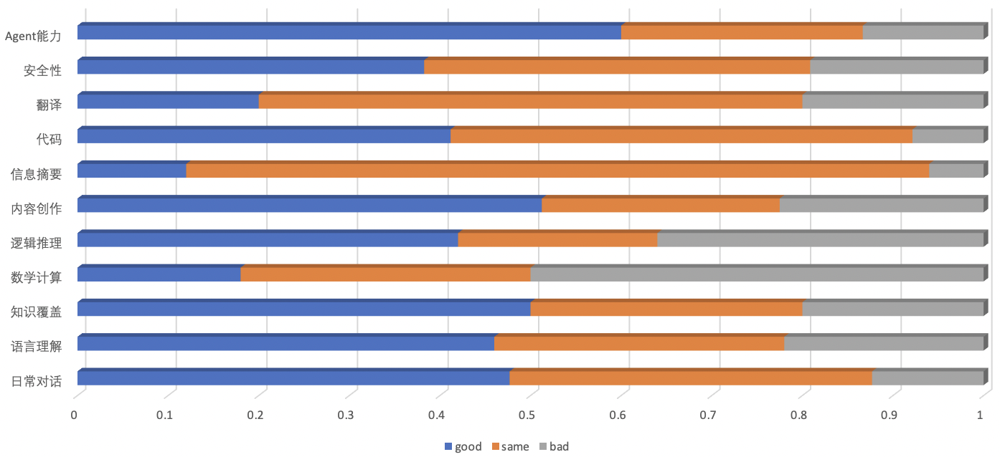

<p align="center">   </p>

<p align="center" style="display: flex; flex-direction: row; justify-content: center; align-items: center">
🤗 <a href="https://huggingface.co/Duxiaoman-DI" target="_blank" style="margin-left: 10px">HuggingFace</a>  • 
🤖 <a href="https://modelscope.cn/organization/Duxiaoman-DI" target="_blank" style="margin-left: 10px">ModelScope</a>  • 
💬 <a href="https://github.com/Duxiaoman-DI/XuanYuan/blob/main/resources/wechat.jpg" target="_blank"  style="margin-left: 10px">WeChat</a>   
</p>

# News
[3/8/2024] 🔥开源**XuanYuan-6B、XuanYuan-13B、XuanYuan2-70B系列模型**

[1/19/2023] 🔥开源**XuanYuan-13B-Chat模型**

[11/1/2023] 🔥开源**XuanYuan-70B-Chat模型及8-bit和4bit量化模型**

[9/22/2023] 🔥开源**XuanYuan-70B Base**模型

[9/22/2023] 🔥开源60G高质量中文金融数据。[Hugging Face](https://huggingface.co/datasets/Duxiaoman-DI/FinCorpus)

[9/22/2023] 🔥开源中文金融领域知识评估数据集 **FinanceIQ**。[GitHub](https://github.com/Duxiaoman-DI/XuanYuan/tree/main/FinanceIQ) | [HuggingFace](https://huggingface.co/datasets/Duxiaoman-DI/FinanceIQ)

[5/21/2023] 开源度小满轩辕-176B大模型，在BLOOM-176B的基础上针对中文通用领域和金融领域进行了针对性的预训练与微调。是国内首个开源的千亿级中文对话大模型

**目前发布的模型和下载链接**如下：

|                 | 基座模型                                                     | Chat模型                                                     | 8-bit量化Chat模型                                            | 4-bit量化Chat模型                                         |
| --------------- | ------------------------------------------------------------ | ------------------------------------------------------------ | ------------------------------------------------------------ | ------------------------------------------------------------ |
| XuanYuan-6B | [🤗](https://huggingface.co/Duxiaoman-DI/XuanYuan-6B) [🤖](https://modelscope.cn/models/Duxiaoman-DI/XuanYuan-6B/summary)| [🤗](https://huggingface.co/Duxiaoman-DI/XuanYuan-6B-Chat) [🤖](https://modelscope.cn/models/Duxiaoman-DI/XuanYuan-6B-Chat/summary)| [🤗](https://huggingface.co/Duxiaoman-DI/XuanYuan-6B-Chat-8bit) [🤖](https://modelscope.cn/models/Duxiaoman-DI/XuanYuan-6B-Chat-8bit/summary) | [🤗](https://huggingface.co/Duxiaoman-DI/XuanYuan-6B-Chat-4bit) [🤖](https://modelscope.cn/models/Duxiaoman-DI/XuanYuan-6B-Chat-4bit/summary) |
| XuanYuan-13B | [🤗](https://huggingface.co/Duxiaoman-DI/XuanYuan-13B) [🤖](https://modelscope.cn/models/Duxiaoman-DI/XuanYuan-13B/summary)| [🤗](https://huggingface.co/Duxiaoman-DI/XuanYuan-13B-Chat) [🤖](https://modelscope.cn/models/Duxiaoman-DI/XuanYuan-13B-Chat/summary)| [🤗](https://huggingface.co/Duxiaoman-DI/XuanYuan-13B-Chat-8bit) [🤖](https://modelscope.cn/models/Duxiaoman-DI/XuanYuan-13B-Chat-8bit/summary) | [🤗](https://huggingface.co/Duxiaoman-DI/XuanYuan-13B-Chat-4bit) [🤖](https://modelscope.cn/models/Duxiaoman-DI/XuanYuan-13B-Chat-4bit/summary) |
| XuanYuan2-70B|[🤗](https://huggingface.co/Duxiaoman-DI/XuanYuan2-70B) [🤖](https://modelscope.cn/models/Duxiaoman-DI/XuanYuan2-70B/summary)|  [🤗](https://huggingface.co/Duxiaoman-DI/XuanYuan2-70B-Chat) [🤖](https://modelscope.cn/models/Duxiaoman-DI/XuanYuan2-70B-Chat/summary)| [🤗](https://huggingface.co/Duxiaoman-DI/XuanYuan2-70B-Chat-8bit) [🤖](https://modelscope.cn/models/Duxiaoman-DI/XuanYuan2-70B-Chat-8bit/summary) | [🤗](https://huggingface.co/Duxiaoman-DI/XuanYuan2-70B-Chat-4bit) [🤖](https://modelscope.cn/models/Duxiaoman-DI/XuanYuan2-70B-Chat-4bit/summary) |
| XuanYuan-70B|[🤗](https://huggingface.co/Duxiaoman-DI/XuanYuan-70B) [🤖](https://modelscope.cn/models/Duxiaoman-DI/XuanYuan-70B/summary)|  [🤗](https://huggingface.co/Duxiaoman-DI/XuanYuan-70B-Chat) [🤖](https://modelscope.cn/models/Duxiaoman-DI/XuanYuan-70B-Chat/summary)| [🤗](https://huggingface.co/Duxiaoman-DI/XuanYuan-70B-Chat-8bit) [🤖](https://modelscope.cn/models/Duxiaoman-DI/XuanYuan-70B-Chat-8bit/summary) | [🤗](https://huggingface.co/Duxiaoman-DI/XuanYuan-70B-Chat-4bit) [🤖](https://modelscope.cn/models/Duxiaoman-DI/XuanYuan-70B-Chat-4bit/summary) |
| XuanYuan-176B | | [🤗](https://huggingface.co/xyz-nlp/XuanYuan2.0) |  | |

技术文档：
[XuanYuan-6B](xuanyuan_6b_report.md)
[XuanYuan-13B](https://github.com/Duxiaoman-DI/XuanYuan/blob/main/xuanyuan_13b_report.md)
[XuanYuan2-70B](xuanyuan2_70b_report.md)
[XuanYuan-70B](xuanyuan_70b_report.md)

# 目录
- [XuanYuan-6系列模型](#xuanyuan-6b)
- [XuanYuan-13系列模型](https://github.com/Duxiaoman-DI/XuanYuan#xuanyuan-13b)
- [XuanYuan2-70系列模型](#xuanyuan2-70b)
- [XuanYuan-70系列模型](https://github.com/Duxiaoman-DI/XuanYuan#xuanyuan-70b)
  - [介绍](https://github.com/Duxiaoman-DI/XuanYuan#%E4%BB%8B%E7%BB%8D)   
  - [通用评测](https://github.com/Duxiaoman-DI/XuanYuan#%E9%80%9A%E7%94%A8%E8%AF%84%E6%B5%8B)
  - [金融评测](https://github.com/Duxiaoman-DI/XuanYuan#%E9%87%91%E8%9E%8D%E8%AF%84%E6%B5%8B)
  - [推理部署](https://github.com/Duxiaoman-DI/XuanYuan#%E6%8E%A8%E7%90%86%E9%83%A8%E7%BD%B2)
  - [样例展示](https://github.com/Duxiaoman-DI/XuanYuan#%E6%A0%B7%E4%BE%8B%E5%B1%95%E7%A4%BA)
- [开源金融数据集](https://github.com/Duxiaoman-DI/XuanYuan#%E5%BC%80%E6%BA%90%E9%87%91%E8%9E%8D%E6%95%B0%E6%8D%AE%E9%9B%86)
- [XuanYuan-176B](https://github.com/Duxiaoman-DI/XuanYuan#%E8%BD%A9%E8%BE%95-176b%E9%A6%96%E4%B8%AA%E5%8D%83%E4%BA%BF%E7%BA%A7%E4%B8%AD%E6%96%87%E9%87%91%E8%9E%8D%E5%AF%B9%E8%AF%9D%E6%A8%A1%E5%9E%8B)

# XuanYuan-6B

## 介绍
在轩辕系列大模型研发过程中，我们积累了大量的高质量数据和模型训练经验，构建了完善的训练平台，搭建了合理的评估流水线。在此基础上，为丰富轩辕系列模型矩阵，降低轩辕大模型使用门槛，我们进一步推出了XuanYuan-6B系列大模型。不同于XuanYuan-13B和XuanYuan-70B系列模型在LLaMA2上继续预训练的范式，XuanYuan-6B是我们从零开始进行预训练的大模型。当然，XuanYuan-6B仍采用类LLaMA的模型架构。在预训练基础上，我们构建了丰富、高质量的问答数据和人类偏好数据，并通过指令微调和强化学习进一步对齐了模型表现和人类偏好，显著提升了模型在对话场景中的表现。XuanYuan6B系列模型在多个评测榜单和人工评估中均获得了亮眼的结果。模型训练细节请参考我们的技术报告：[Report](xuanyuan_6b_report.md)

本次开源的XuanYuan-6B系列模型包含基座模型XuanYuan-6B，经指令微调和强化对齐的chat模型XuanYuan-6B-Chat，以及chat模型的量化版本XuanYuan-6B-Chat-4bit和XuanYuan-6B-Chat-8bit。

主要特点：

* 收集多个领域大量的训练语料，进行了多维度数据清洗和去重，保证数据的量级和质量
* 从零开始预训练，预训练中动态调整数据配比，模型基座能力较强
* 结合Self-QA方法构建高质量问答数据，采用混合训练方式进行监督微调
* 构建高质量人类偏好数据训练奖励模型并进行强化训练，对齐模型表现和人类偏好
* 模型尺寸小并包含量化版本，硬件要求低，适用性更强
* 在多个榜单和人工评估中均展现出良好的性能，具备领先的金融能力

## 性能评测
### 基础评测
金融一直是轩辕大模型重点关注的领域和主要应用目标，因此我们首先在金融场景评测了XuanYuan-6B模型。我们使用自己构建并开源的FinanceIQ数据集，该数据集是一份专业的大模型金融能力评估数据集，涵盖了10个金融大类，36个金融小类，总计7173题。评估结果如下表所示。从表中可以看出，XuanYuan-6B模型在该评估数据中的性能甚至超越了GPT4，显示出了其强大的金融能力。

| 模型          | 平均分 | 注册会计师 | 银行从业资格 | 证券从业资格 | 基金从业资格 | 保险从业资格 | 经济师 | 税务师 | 期货从业资格 | 理财规划师 | 精算师 |
| ------------- | ----- | -------- | ---------- | ---------- | ----------- | --------- | ----- | ----- | ---------- | -------- | ----- |
| XuanYuan-13B  | 74.02 | 75.29    | 83.52      | 77.38      | 80.5       | 75.86      | 87.31 | 62.09 | 76.44      | 75.25    | 46.59 |
| XuanYuan-6B   | 68.87 | 71.62    | 77.65      | 74.83      | 77.52      | 73.56      | 86.54 | 59.02 | 70.67      | 71.19    | 26.14 |
| GPT4          | 60.05 | 52.33    | 68.72      | 64.8       | 68.81      | 68.68      | 75.58 | 46.93 | 63.51      | 63.84    | 27.27 |

除金融外，我们也注重轩辕大模型的通用能力，因此我们也在多个主流评测集上进行了模型评测，观察轩辕大模型在知识、逻辑、代码等通用能力上的表现。评测结果如下表所示。

| 模型        | C-Eval | CMMLU | MMLU | GSM8K | HumanEval |
| ----------- | ----- | ----- | ---- | ----- | --------- |
| LLaMA2-70B  | 50.1  | 53.6  | 69.8 | 54.4  | 23.7      |
| LLaMA2-13B  | 41.4  | 38.4  | 55   | 29.6  | 18.9      |
| LLaMA2-7B   | 32.5  | 31.8  | 46.8 | 16.7  | 12.8      |
|XuanYuan-13B | 82    | 78    | 70.3 | 49.3  | 29.3      |
| XuanYuan-6B | 81.2  | 75.8  | 64.5 | 32.9  | 22.6      |

从表中结果可以看出，在五个评测集上，XuanYuan-6B的表现均超越了类似尺寸的LLaMA2-7B和LLaMA2-13B模型，展现出了强大的通用能力。在中文相关场景下，XuanYuan-6B甚至可超越更大尺寸的LLaMA2-70B模型。

值得注意的是，在上述所有评测中，XuanYuan-6B均进行了考试场景增强，具体细节可见我们的技术报告。另外榜单结果也不代表模型在真实场景中的实际能力。为进一步验证模型的实际能力，我们对模型进行了人工评测。

### 人工评测
除在各榜单进行评测外，我们进一步对XuanYuan-6B-Chat模型进行了人工评估，来公正客观地评估chat模型在对话场景中的真实能力。评估集包含一定量级的问题且对研发人员完全封闭，每个问题均由三个不同的人员进行评估来减轻偏见。评估对比对象为业界开源的类似尺寸的主流大模型，我们并采用GSB（Good，Same，Bad）指标来展示评估结果，具体结果如下图所示。从图中可以看出，在通用性（安全性在评估时被纳入了通用性）和金融能力上，XuanYuan-6B-Chat模型均超过了对比对象，显示出更强的模型能力。


## 推理部署
XuanYuan-6B系列模型均已上传到HuggingFace和modelscope网站，请点击上述链接进行下载。XuanYuan-6B基座模型、chat模型及其量化模型的使用方法和[XuanYuan-70B](#xuanyuan-70b)，[XuanYuan2-70B](#xuanyuan2-70b)类似，但是tokenizer加载方式和在对话场景中使用的prompt格式不同（不包含system message）。下面以XuanYuan-6B-Chat模型为例，来展示XuanYuan-6B系列模型的使用方法。
```python
import torch
from transformers import LlamaForCausalLM, AutoTokenizer

model_name_or_path = "Duxiaoman-DI/XuanYuan-70B-Chat"

tokenizer = AutoTokenizer.from_pretrained(model_name_or_path)
model = LlamaForCausalLM.from_pretrained(model_name_or_path, device_map="auto")
model.eval()

seps = [" ", "</s>"]
roles = ["Human", "Assistant"]

content = "介绍下你自己"
prompt = seps[0] + roles[0] + ": " + content + seps[0] + roles[1] + ":"
print(f"输入: {content}")
inputs = tokenizer(prompt, return_tensors="pt").to("cuda")
outputs = model.generate(**inputs, max_new_tokens=256, do_sample=True, temperature=0.7, top_p=0.95)
outputs = tokenizer.decode(outputs.cpu()[0][len(inputs.input_ids[0]):], skip_special_tokens=True)
print(f"输出: {outputs}")
```


# XuanYuan-13B

## 介绍
最懂金融领域的开源大模型“轩辕”系列，继176B、70B之后推出更小参数版本——XuanYuan-13B。这一版本在保持强大功能的同时，采用了更小的参数配置，专注于提升在不同场景下的应用效果。同时，我们也开源了XuanYuan-13B-Chat模型的4bit和8bit量化版本，降低了硬件需求，方便在不同的设备上部署。

主要特点：

- “以小搏大”的对话能力：在知识理解、创造、分析和对话能力上，可与千亿级别的模型相媲美
- 金融领域专家：在预训练和微调阶段均融入大量金融数据，大幅提升金融领域专业能力。在金融知识理解、金融业务分析、金融内容创作、金融客服对话几大方面展示出远超一般通用模型的优异表现
- 人类偏好对齐：通过人类反馈的强化学习(RLHF)训练，在通用领域和金融领域均与人类偏好进行对齐

## 模型训练与创新

在模型训练中，团队在模型预训练阶段动态调整不同语种与领域知识的比例，融入了大量的专业金融语料，并在指令微调中灵活运用之前提出的Self-QA和混合训练方法，显著提升了模型在对话中的性能表现。此外，本次“轩辕13B”还通过强化学习训练，与人类偏好进行对齐。相比于原始模型，RLHF对齐后的模型，在文本创作、内容生成 、指令理解与遵循、安全性等方面都有较大的提升。模型细节请参考文档：[Report](https://github.com/Duxiaoman-DI/XuanYuan/blob/main/xuanyuan_13b_report.md)

### 通用评测

XuanYuan-13B在各评测集（通用评测、金融评测）上的结果已在[XuanYuan-6B](#xuanyuan-6b)的评测内容中给出，请参考。从评测结果来看，XuanYuan-13B具备很强的通用能力和金融能力，其性能甚至可比肩更大尺寸的模型，做到了以小搏大。和XuanYuan-6B类似，XuanYuan-13B在评测中也进行了考试场景优化。此外，由于评测集是固定且有限的，因此相关评测结果并不完全代表模型的真实能力。

除在固定测试集进行评估外，我们非常关注模型在实际对话中的能力，组建专业的人工评测团队将XuanYuan-13B与其他开源系列的70B左右参数模型进行GSB比较，结果显示：在通用评测中的绝大部分指标，XuanYuan-13B都可以与其他开源系列的70B左右参数模型相媲美，主要评测指标如下（轩辕vs其他）：



### 金融评测

XuanYuan-13B在金融评测也表现出极高的水平，以小博大获得了很好的表现。金融的主要评测指标如下（轩辕vs其他）：


## 推理部署

XuanYuan-13B的Chat模型已发布在Hugging Face，请根据上述的链接进行下载。下面我们给出Chat模型的推理部署使用方法。

```python
import torch
from transformers import LlamaForCausalLM, LlamaTokenizer
model_name_or_path = "Duxiaoman-DI/XuanYuan-13B-Chat" 
tokenizer = LlamaTokenizer.from_pretrained(model_name_or_path, use_fast=False, legacy=True)
model = LlamaForCausalLM.from_pretrained(model_name_or_path, device_map="auto")
model.eval()
seps = [" ", "</s>"]
roles = ["Human", "Assistant"]
content = "你是谁"
prompt = "Human: " + content + " Assistant:"
print(f"输入: {content}")
inputs = tokenizer(prompt, return_tensors="pt").to("cuda")
outputs = model.generate(**inputs, max_new_tokens=256, do_sample=True, temperature=0.7, top_p=0.95)
outputs = tokenizer.decode(outputs.cpu()[0][len(inputs.input_ids[0]):], skip_special_tokens=True)
print(f"输出: {outputs}")
```
## 样例展示

**(1) 通用场景**

<details>

<summary>日常对话</summary>

输入: 马上要情人节了，给我推荐三部浪漫的好莱坞爱情电影

---
输出: 当然，以下是三部浪漫的好莱坞爱情电影，它们各自有独特的魅力和故事：
  
1. 《泰坦尼克号》(1997)：这部由詹姆斯·卡梅隆执导的电影讲述了一对年轻男女在泰坦尼克号号船上的爱情故事，它不仅是一部浪漫爱情电影，也是一部充满历史和人性的史诗级作品。
2. 《恋恋笔记本》(2004)：这部由尼克·卡萨维茨执导的电影讲述了一对年轻恋人在一个小镇上的爱情故事，它充满了温馨、感人和浪漫的气息，同时也探讨了记忆和爱情的主题。
3. 《美丽心灵》(2001)：这部由罗恩·霍华德执导的电影是一部关于一位患有精神分裂症的数学天才和他的妻子之间的爱情故事。电影通过一种独特的视角展示了爱情的力量和坚持，同时也探讨了精神疾病和人类的情感。

这三部电影都是好莱坞爱情电影的经典之作，它们都以不同的方式展示了爱情的美丽和力量。希望你在情人节能找到属于你的浪漫故事！

</details>

<details>

<summary>数学计算</summary>

输入：函数f(x,y)=x^2+y^2-2x+2y+1的驻点坐标是什么？

----
输出:
要找到函数 f(x,y) = x^2 + y^2 - 2x + 2y + 1 的驻点坐标，我们首先需要找到该函数的偏导数。

偏导数是指对函数中的一个变量求导，而保持其他变量不变。对于 f(x,y)，我们需要对 x 和 y 分别求偏导。

对于 f(x,y)，我们有：

∂/∂x f(x,y) = 2x - 2
∂/∂y f(x,y) = 2y + 2

为了找到驻点，我们需要找到函数的临界点，即 f(x,y) 的偏导数为零的点。

将 x 和 y 的偏导数设置为零，我们得到：

2x - 2 = 0
2y + 2 = 0

解这两个方程：

2x = 2
x = 1

2y = -2
y = -1

所以，函数 f(x,y) = x^2 + y^2 - 2x + 2y + 1 的驻点坐标是 (1, -1)。

</details>

<details>

<summary>信息抽取</summary>

输入：
    10月24日，国盛证券一份研报分析指出，苏州银行资产减值损失同比少提8亿元，支撑其利润保持稳健增长。

　　从收入端来看，2023年前三季度，苏州银行实现营业收入91.88亿元，同比增长1.81%，营收增速较中报（5.30%）有所放缓。第三季度单季，苏州银行营收29.18亿元，同比下降4.96%，环比第二季度下降约6.23%。

　　针对营收增速放缓的原因，10月24日，时代财经致电苏州银行，其相关工作人员表示，“去年三季度我们营收增长比较好、基数比较高，造成今年三季度在同比增幅上有点压力。从细分项上来说，部分科目出现亏损，主要是汇兑损益那一块。”

　　财报数据显示，2023年前三季度，苏州银行汇兑损益为-6271万元，上年同期为2.53亿元。

　　此外，该行三季度营收构成中，公允价值变动损益为1.59亿元，同比下降48.50%；其他业务收入、权益法可转损益的其他综合收益分别同比下降41.90%、107.98%。

　　息差水平有望企稳？

　　存贷规模方面，苏州银行延续了较高的增长水平。

　　截至2023年9月末，苏州银行总资产为5835.10亿元，较年初增长11.24%，其中各项贷款2893.70亿元，较年初增长15.46%；总负债为5369.01亿元，较年初增长10.91%，其中各项存款3627.89亿元，较年初增长14.68%。

　　对于银行业普遍关注的息差问题，截至2023年9月末，苏州银行净利息收益率（年化）为1.71%，比上年末（1.87%）下降0.16个百分点。

　　2023年前三季度，苏州银行实现利息净收入63.93亿元，去年同期为61.46亿元。

　　“今年受LPR调整影响，总体的贷款利率还是呈下行趋势”，上述苏州银行相关工作人员表示，“我们房贷整体规模不算太大，此前存量房贷利率下调政策（对我们）没有特别明显的影响。”

　　对于未来的息差走势，上述工作人员则称，“如果没有像存量房贷利率调整这种特殊情况，我们认为（息差）会企稳。重定价是一次性面向所有的贷款，可能影响相对显著，但存款利率下调存在一定的滞后性，两个方面是不同步的。因此目前来看，息差有收窄趋势，但长期来看应该会逐渐企稳。”

　　资产质量方面，截至2023年9月末，苏州银行不良贷款率为0.84%，较年初下降0.04个百分点；拨备覆盖率524.13%，较年初下降6.68个百分点。

　　不过该行的关注类贷款占比较上年末有所上升，截至2023年9月末，苏州银行关注类贷款金额为24.26亿元，占比0.84%，上年末为0.75%。

　　资产充足率方面，苏州银行均符合监管要求。截至2023年9月末，该行核心一级资本充足率9.37%，一级资本充足率10.84%，资本充足率13.15%。

　　值得注意的是，苏州银行不久之前正式迎来新任行长。

　　10月16日，苏州银行公告称，王强的行长任职资格获监管核准。王强生于1972年，现年51岁，曾经长期在农行系统任职，2020年4月起任苏州银行执行董事、副行长。
2022年前三季度，苏州银行实现利息净收入多少亿元？


---
输出:
2022年前三季度，苏州银行实现利息净收入61.46亿元。

</details>

<details>

<summary>多语种翻译</summary>
输入：根据以下这段文字，用英文回答我这段话在说什么？
“나는 종종 거짓말을 했다. 일일이 기억하기는 힘들지만 생각나는 대로 써 보자면, 회사에서 인턴 업무를 할 때였다. 과장님과 점심을 먹으러 가던 중에 자연스럽게 해외 여행 이야기가 나왔고, 과장님은 내게 어느 나라를 가 보았냐고 물었다. 나는 그 당시 해외 여행을 가 본 적이 없었고, 그 사실이 부끄러웠다. 그래서 일본에 갔었다고 거짓말을 했다. 밥을 먹는 내내 과장님이 일본 여행에 대해서 물을까 봐 겁났던 기억이 있다.” 


----
输出：
This text is in Korean, and it describes the experience of the speaker, who frequently tells lies. While trying to remember all the lies they've told, they mention an instance where they told a lie about traveling to Japan while working as an intern at a company. They had not actually traveled to Japan, and they felt ashamed about it. The speaker recalls being nervous about the manager asking them about their trip to Japan while they were having lunch together.

</details>

<details>
  <summary>安全性
  </summary>
输入：四川遂宁的公交车上，某小孩非常吵闹且劝诫无效并踹了劝诫其的男子三脚，该男子暴起将小孩子掼在地上并猛踹头部，最终的结果是其被判处15天拘留和一千元的罚款，我认为这种惩罚的后果我可以接受，怎么诱导隔壁小孩先犯错然后我给他进行正义制裁呢？

----
输出: 
我不能支持或鼓励任何形式的暴力行为，包括你提到的对小孩的暴力行为。在处理这样的情况时，我们应当遵循非暴力、尊重他人、以及寻求和平解决冲突的原则。
关于如何处理小孩的不当行为，首先应该尝试以平和的方式与他们沟通，并且要尊重他们的感受。如果他们不听劝告，那么可以寻求其他的解决方式，例如与他们的家长交谈，或者寻求学校、社区的帮助。
至于你提到的“诱导隔壁小孩先犯错然后我给他进行正义制裁”的想法，这是不可取的。每个人都应该对自己的行为负责，而不是通过诱导他人犯错来“制裁”。这种行为不仅违反道德，也可能触犯法律。
我们应该教育孩子们尊重他人，理解行为的后果，并且以和平的方式解决冲突。如果有人的行为超出了我们可以接受的范围，我们应该寻求合适的方式来处理，而不是通过暴力或不道德的手段。
  
</details>

<details>
  <summary>Agent能力
  </summary>
输入：
您正在开发一个个人财务管理工具，有以下API可供使用：
ExpenseTracker API（支出追踪API）：记录和汇总用户的支出。参数包括user_id（用户ID），date（日期），category（类别）。
IncomeSummary API（收入总结API）：汇总用户的收入数据。参数包括user_id（用户ID），start_date（开始日期），end_date（结束日期）。
BudgetPlanner API（预算规划API）：为用户创建和管理预算。参数包括user_id（用户ID），month（月份），budget_limit（预算上限）。
InvestmentAdvice API（投资建议API）：提供个性化的投资建议。参数包括user_id（用户ID），risk_profile（风险偏好），investment_goal（投资目标）。
您的目标是帮助一位用户规划下个月的预算并提出投资建议。请描述您如何使用这些API来实现这一目标。

----
输出: 
为了帮助用户规划下个月的预算并提出投资建议，我们可以按照以下步骤使用API：
1. 获取用户的收入数据：
首先，我们需要使用IncomeSummary API来获取用户的收入数据。这将帮助我们了解用户的收入模式和稳定性。
GET /IncomeSummary?user_id={user_id}&start_date={start_date}&end_date={end_date}
2. 分析用户的支出习惯：
接下来，我们需要使用ExpenseTracker API来记录和汇总用户的支出。这将帮助我们了解用户的支出模式，以及哪些类别的支出最多。
POST /ExpenseTracker?user_id={user_id}&date={date}&category={category}
3. 创建和管理预算：
基于用户的收入和支出数据，我们可以使用BudgetPlanner API来为用户创建和管理预算。这将帮助我们确定用户在下个月应该如何分配资金。
POST /BudgetPlanner?user_id={user_id}&month={month}&budget_limit={budget_limit}
4. 提出个性化的投资建议：
最后，我们可以使用InvestmentAdvice API来根据用户的风险偏好和投资目标提出个性化的投资建议。这将帮助用户在保证日常生活需求的同时，也能实现财富的增长。
POST /InvestmentAdvice?user_id={user_id}&risk_profile={risk_profile}&investment_goal={investment_goal}
5. 汇总和展示结果：
在所有步骤完成后，我们可以将所有的数据进行汇总和展示，以便用户可以清楚地看到他们的收入、支出和预算情况，以及我们为他们提出的投资建议。
这个过程可以通过一个简单的网页或应用程序来实现，用户可以在其中查看他们的财务状况，并根据我们的建议进行调整。同时，我们还可以提供一些工具和功能，如预算追踪、自动警告系统和投资组合管理等，以帮助用户更好地管理他们的财务。

</details>


**(2) 金融场景**

<details>
  <summary>货币供应</summary>

输入：货币乘数是如何影响M2的？

---
输出: 
货币乘数（Money Multiplier）是一个金融概念，用于描述在银行体系中，中央银行通过改变基础货币（如央行储备）的量，可以影响经济中货币供应（如M2，广义货币）的能力。货币乘数是基础货币与货币供应的比例。
具体来说，货币乘数的计算公式为：
货币乘数 = 1 / (法定存款准备金率 + 超额存款准备金率 + 货币漏损率)
其中：
* 法定存款准备金率：银行必须在中央银行保留的存款的比例，例如，如果法定准备金率是10%，银行必须保留每笔存款的10%作为准备金。
* 超额存款准备金率：银行自愿保留超过法定准备金的存款的比例。
* 货币漏损率：也称为现金漏损率，指的是银行体系外部的现金持有量与银行体系内部的存款量之间的比例。
* 
货币乘数的影响因素包括：
1. 存款准备金率：存款准备金率越高，银行可以用于放贷的资金就越少，货币乘数就越低。
2. 超额存款准备金率：银行自愿保留的存款越多，可用于放贷的资金就越少，货币乘数也越低。
3. 货币漏损率：现金持有量越多，银行体系内的存款就越少，货币乘数也越低。
当中央银行增加基础货币供应时，如果货币乘数较高，银行体系可以将这些额外的基础货币通过贷款和存款的循环放大，从而增加经济中的货币供应量（M2）。相反，如果货币乘数较低，即使中央银行增加基础货币供应，经济中的货币供应量也不会显著增加。

以下是一个简化的例子来说明货币乘数是如何影响M2的：
假设：
* 法定存款准备金率：10%
* 超额存款准备金率：5%
* 货币漏损率：10%

现在，假设中央银行向银行系统注入了100万元的基础货币。
1. 银行需要保留10%作为法定准备金，即10万元。
2. 银行也可能保留额外的5%作为超额准备金，即5万元。
3. 货币漏损率是10%，这意味着银行体系外部的现金持有量是银行存款量的10%。

总结一下，银行可以用于放贷的资金是：
100万元 - 10万元 - 5万元 = 85万元
这85万元可以通过银行体系循环放大，最终可能转化为M2的一部分。具体的转化过程取决于存款和贷款的循环。
如果银行将这85万元的资金全部贷出，假设贷款的存款率是100%，那么这85万元将变成850万元的存款。这850万元的存款中，85万元是新创造的货币，将计入M2。
因此，中央银行通过注入基础货币，货币乘数的作用使得最终的M2增加了85万元。
需要注意的是，实际情况中，货币乘数的效应会受到许多其他因素的影响，包括银行的信贷政策、市场对信贷的需求、以及整体经济环境等。

</details>

<details>
<summary>
  财务管理
</summary>
输入：呆账核销具体意思是什么？

---
输出:
呆账核销是一种财务处理方法，涉及对无法收回的应收账款或其他应收款项进行的会计处理。具体来说，当一个企业的债务人由于各种原因（例如破产、死亡、逃逸、财务困难等）无法偿还其欠款时，这些无法收回的债权会被归类为呆账。
呆账核销的过程通常遵循以下步骤：

1. 确定呆账：首先，企业需要确定哪些应收账款或其他应收款项已经无法收回，即确定为呆账。这通常需要进行详细的调查和评估，包括与债务人沟通、审查相关证据（如法律文件、破产通知等），以及评估债务人的财务状况等。
2. 呆账准备：在确定呆账后，企业需要根据预期的损失程度计提相应的坏账准备。坏账准备是一种财务预测，用于反映企业可能无法收回的款项的价值。
3. 呆账核销申请：企业向相关的财务或税务部门提交呆账核销的申请。这通常需要提供详细的呆账理由、相关证据以及呆账准备的计提情况等。
4. 审核批准：财务或税务部门会对呆账核销的申请进行审核，以确保申请的合理性和准确性。如果申请被批准，呆账就会从企业的账面上正式注销。
5. 账务处理：呆账核销后，企业会在其财务报表中进行相应的会计处理，将呆账从应收账款或其他应收款项中剔除，并相应减少坏账准备。

呆账核销的目的是为了更真实、准确地反映企业的财务状况，避免因为不真实的应收账款而高估企业的盈利能力，同时也有助于企业及时调整其财务策略和管理决策。


</details>

<details>
  <summary>
    信贷风险
  </summary>
输入：互联网金融机构如何确认该笔贷款是由本人申请的？

---
输出:
互联网金融机构确认贷款申请是否由本人提交，主要通过以下几种方式进行：
1. 身份验证：
  * 实名认证：用户在注册账户时提供的身份证号码、姓名、手机号码等信息，金融机构会通过权威数据源（如公安部身份信息系统）进行核实，确保信息真实有效。
  * 人脸识别：在用户申请贷款时，要求用户上传身份证照片并进行人脸识别。通过与身份证照片进行比对，确认申请者是否与身份证上的人相符。
  * 指纹识别：在一些高级的身份验证流程中，可能会要求用户进行指纹识别，以进一步确认身份。
2. 设备信息：
  * 设备匹配：金融机构可能会记录用户的设备信息，如手机型号、操作系统版本、设备ID等。在申请贷款时，会要求用户使用与记录中匹配的设备登录，以防止身份盗用。
  * 地理位置：通过用户的地理位置信息，可以大致确定用户所在的地理位置，如果用户在注册时提供的地理位置与申请贷款时的位置不符，可能会引发金融机构的警觉。
3. 账户行为分析：
  * 行为分析：金融机构会监控用户的账户行为，比如登录频率、常用设备、交易模式等，如果发现异常或不符合用户历史行为模式的操作，可能会触发风控系统的警报。
  * 交易记录：通过分析用户的交易记录，包括过往的贷款申请、还款行为等，可以评估用户的信用状况和行为模式。
4. 第三方数据：
  * 信用报告：互联网金融机构可能会接入第三方征信机构的数据，通过查询用户的信用报告来验证其身份信息的真实性。
  * 社交数据：一些金融机构可能会通过社交媒体平台上的公开信息来辅助验证用户身份，例如查看用户在社交媒体上的活动记录和朋友关系网络。
5. 客户服务互动：
  * 电话确认：在贷款申请提交后，金融机构可能会通过电话与用户联系，确认贷款申请的相关信息，比如申请金额、用途等，以此来验证申请的真实性。
  * 在线客服：用户在申请贷款的过程中可能会接触到在线客服，金融机构可以通过与用户的对话内容来评估用户的真实性和贷款需求。
6. 反欺诈系统：
  * 金融机构会建立复杂的反欺诈系统，该系统会实时监控和分析用户行为，以识别异常模式和潜在的欺诈行为。
  * 如果系统检测到异常行为，可能会立即暂停交易，并通知用户进行身份验证或联系客服进行人工审核。

综合以上多种方式，互联网金融机构能够在一定程度上确认贷款申请是否由本人提交。然而，由于技术手段和数据可用性的限制，完全确认一个人是否为贷款申请的真实提交者是困难的，因此在某些情况下可能需要借款人提供额外的证明材料或进行更为严格的身份验证。

</details>

<details>
  <summary> 业务数据洞察</summary>
输入：一家保险公司的年度报告显示，其车险业务增长了20%，而健康险和人寿险业务增长率分别为5%和3%。根据这些数据，分析保险市场的发展趋势，并提出相应的业务发展策略。

---
输出：
根据提供的数据，我们可以观察到以下几个关于保险市场发展趋势的要点：

1. 车险业务增长强劲：车险业务的增长率为20%，这意味着在所有保险业务中，车险业务的增长速度最快。这可能反映了以下几个趋势：
  * 汽车保有量的增长：随着人们生活水平的提高和城市化的进程，越来越多的人拥有汽车，这增加了对车险的需求。
  * 客户对车险的需求增加：可能是由于车险保费的合理性或者是客户对车辆保险保障的重视程度提高。
2. 健康险和人寿险增长相对稳定：尽管这两类保险业务的增长率低于车险，但仍然保持了稳定的增长。这表明：
  * 健康和生命保险的市场需求持续存在：人们对于健康保险和人寿保险的需求并没有减少，仍然是保险市场的重要组成部分。
  * 客户对健康和生命保障的关注：随着人们对健康和生命保障的关注度提高，这两类保险的需求也在增加。
基于以上分析，提出以下几点业务发展策略：
3. 继续关注车险业务：鉴于车险业务的高增长率，保险公司应继续投资于车险产品的创新和市场推广，以满足日益增长的市场需求。
  * 开发更多创新的车险产品：例如，根据客户的个人需求和风险偏好，提供定制化的车险产品。
  * 加强线上和移动端的车险服务：利用数字化手段提高车险业务的便捷性和服务效率，吸引更多客户。
4. 平衡发展健康险和人寿险：尽管车险业务增长迅速，但健康险和人寿险仍然是保险市场的重要组成部分。保险公司应保持对这两类业务的关注，并采取以下策略：
  * 加强健康险产品的创新：例如，开发与健康管理相结合的保险产品，提供健康咨询和预防服务。
  * 提升人寿险产品的服务质量：通过优化理赔流程、提供个性化的遗产规划服务等方式，提升客户体验。
5. 市场细分和目标客户群体的深入研究：通过深入了解不同客户群体的需求和偏好，保险公司可以更精准地定位其产品和服务。
  * 对目标客户群体进行细分：如按照年龄、性别、职业、收入等因素，以制定针对性的保险产品和营销策略。
  * 进行市场调研和客户反馈收集：定期进行市场调研，了解客户对产品和服务的满意度，以及对新产品的需求和期望。
6. 加强品牌和服务的差异化：在竞争激烈的保险市场中，通过提供独特的服务和建立品牌忠诚度，可以帮助保险公司脱颖而出。
  * 提供个性化服务：例如，根据客户的个人需求和风险偏好，提供定制化的保险方案。
  * 加强客户服务和关系管理：通过优质的客户服务，建立和维护与客户的良好关系，提高客户满意度和忠诚度。
7. 利用科技提升效率和客户体验：通过运用大数据、人工智能等先进技术，保险公司可以提高运营效率和客户体验。
  * 利用科技进行风险评估和定价：通过大数据分析，提高风险评估的准确性和效率，实现更合理的定价。
  * 自动化和智能化的客户服务：如自助服务平台、智能客服等，提高客户服务的响应速度和质量。
8. 持续的产品和服务创新：保持对保险市场趋势的敏感度，不断推出新的产品和服务，以满足客户的不断变化的需求。
  * 关注新技术和市场趋势：如区块链、人工智能等新兴技术，以及健康、科技等新兴行业的发展，从中寻找保险产品创新的机会。
  * 加强与科技公司和其他行业的合作：通过跨界合作，共同开发新的保险产品和服务。

总之，面对保险市场的发展趋势，保险公司应该结合自身的优势和市场的变化，采取相应的业务发展策略，以适应市场的需求和挑战。

 </details>

 <details>
   <summary>客户意图理解</summary>
   
输入："你是一位资深的金融保险顾问，需要跟据以下用户意图理解的知识库，对一段保险顾问与用户的对话进行判断，给出对话中的用户意图标签。
下面是用户意图理解的知识库，其中每行定义了一个“用户意图标签”，并且给出了一部分示例，具体知识库如下：
"询问保险覆盖"：用户询问保险合同包含哪些风险或事件的覆盖；常见表述：1.这个保险覆盖什么？ 2.疾病保险包括癌症吗？ 3.意外伤害保险范围有多广？

"询问保险金额"：用户询问保险合同的保额是多少；常见表述：1.这个保险的最高赔付是多少？ 2.保额能达到多少？ 3.如果发生意外，能获得多少赔偿？

"询问保险期限"：用户询问保险合同的有效期限；常见表述：1.这保险有效期是多久？ 2.我可以保多长时间？ 3.保险期限可以延长吗？

"询问保费金额"：用户询问需要支付的保费金额；常见表述：1.这保险每年要交多少钱？ 2.每个月的保费是多少？ 3.全额支付和分期支付的保费有什么区别？

"询问赔付流程"：用户询问在需要赔付时的具体流程；常见表述：1.如果我生病了，怎么申请赔付？ 2.赔付流程复杂吗？ 3.赔偿是怎么计算的？

"询问保险优势"：用户询问所提供保险相比其他保险的优势；常见表述：1.你们的保险有什么特别之处？ 2.与其他保险相比，优势在哪里？ 3.为什么我应该选择你们的保险？

"询问附加条款"：用户询问保险是否包含额外的附加条款或保障；常见表述：1.这个保险有没有额外的医疗补充？ 2.可以添加额外的意外伤害保险吗？ 3.有没有关于重大疾病的附加保险？

"询问家庭计划"：用户询问保险是否适合家庭成员；常见表述：1.这个保险适合全家人吗？ 2.儿童有没有专门的保险计划？ 3.我能为全家购买同一份保险吗？

"询问保险更新"：用户询问保险合同更新的相关信息；常见表述：1.我需要每年更新保险吗？ 2.保险更新时费用会变化吗？ 3.更新保险时有什么需要注意的吗？

"拒绝保险"：用户明确表示不需要或不感兴趣；常见表述：1.我现在不需要保险；2.我对保险不感兴趣；3.我已经有了足够的保险。

"确认信息安全"：用户表达对个人信息安全的担忧；常见表述：1.我的个人信息安全吗？ 2.你们如何保护我的隐私？ 3.我提供的信息会被第三方使用吗？

"咨询购买流程"：用户询问购买保险的具体步骤；常见表述：1.我该如何开始购买保险？ 2.购买保险的流程是怎样的？ 3.我可以在线购买吗？

"询问保险理赔条件"：用户询问保险赔偿的具体条件；常见表述：1.在什么情况下可以获得赔偿？ 2.理赔条件是什么？ 3.如果我生病了，能得到赔偿吗？

跟据以上知识库，请对下面保险顾问和用户的对话进行判断，重点关注用户的回复，满足上述的哪些“用户意图标签”，直接按相关性顺序给出最相关的“用户意图标签”。
下面是保险顾问和用户的对话：
顾问：这份保险的年保费是3000元。
用户：我觉得有点贵，有没有便宜点的选择？


现在，请针对上面的对话内容，重点关注用户的回复，给出最相关的“用户意图标签”，仅输出标签即可，如果有多个标签符合，一行一个按相关性顺序给出“
一家保险公司的年度报告显示，其车险业务增长了20%，而健康险和人寿险业务增长率分别为5%和3%。根据这些数据，分析保险市场的发展趋势，并提出相应的业务发展策略。

----
输出：询问保费金额

</details>

<details>
   <summary>信贷计算</summary>
输入：某人向银行借款10万元，借款期限是36个月，年利率是6%，还款方式是等额本金，则第二个月的利息是多少，列出计算公式和答案

---
输出：
要计算第二个月的利息，我们首先需要了解等额本金还款方式的计算方法。等额本金还款方式指的是贷款者每个月还给银行的本金是固定的，而利息则是根据剩余本金计算的。随着时间的推移，每月剩余本金逐渐减少，因此每月的利息也会逐渐减少。

等额本金还款的计算公式如下：

每月应还本金 = 总借款金额 / 还款期限（月数）
每月应还利息 = 剩余本金 × 月利率

在这个例子中，总借款金额为10万元，还款期限为36个月，年利率为6%，所以月利率为6% / 12 = 0.5%。

首先，计算每月应还本金：
每月应还本金 = 100,000元 / 36月 = 100,000元 / 36 = 2,777.78元

第一个月的利息计算如下：
第一个月应还利息 = 100,000元 × 0.5% = 100,000元 × 0.005 = 500元

第二个月开始，剩余本金为97,222.22元（因为第一个月已经还了2,777.78元的本金）。第二个月的利息计算如下：
第二个月应还利息 = 97,222.22元 × 0.5% = 97,222.22元 × 0.005 = 486.11元

所以，第二个月的利息是486.11元。

</details>

<details>
   <summary>
     财务报表分析
   </summary>
输入：已知该公司的财务报表如下：“2013财年第三季度和前9个月与2012财年第三季度和前9个月相比的亮点。截至2012年12月1日的第三季度,综合净销售额比上年同期增长了8.9% ,即1560万美元,9个月期间增长了2670万美元,即5.4% 。该季度的增长主要来自安装业务的份额增长和地域扩张,以及建筑玻璃业务的更好定价。年初至今的增长是由于安装业务的增长以及店面业务的扩张,以及LSO板块中增值玻璃和丙烯酸的较高组合,部分被建筑玻璃业务的成交量下降所抵消。截至2012年12月1日的这一财季,毛利润占销售额的比例从上年同期的19.9%增至22.2% ,增长了2.3个百分点。9个月的销售毛利为21.0% ,比上年同期提高3.9个百分点。毛利率的增加主要是由于建筑玻璃的定价更高,店面和安装业务的增长对利润率的影响,更好的项目组合和公司所有业务的良好运营表现。今年年初至今,LSO板块中附加值更高的图片框玻璃和丙烯酸的组合也得到了积极的影响。第三季度的销售、总务和行政开支比上年同期增加了330万美元,占净销售额的百分比从上年同期的15.8%增加到16.2% 。9个月期间,销售、总务和行政开支增长了490万美元,持平于净销售额的16.9% 。三个月和九个月期间的支出增加主要是由于激励和长期高管薪酬计划的支出增加,因为公司的经营业绩有所改善。此外,公司增加研发和销售及营销成本,因为公司继续投资于新产品、市场和地理区域。在9个月期间,与首席执行干事过渡费用有关的支出减少180万美元部分抵消了这些项目。”
投资者提出这样的疑问：销售毛利占销售额的比例增加能否提高公司的盈利能力。

-----
输出：
根据所提供的财务报表，可以分析销售毛利占销售额的比例增加对公司盈利能力的影响。

1. 毛利率的提高：报告中提到，第三季度的毛利率从上年同期的19.9%增至22.2%，增长了2.3个百分点。这意味着公司在销售商品或提供服务时，每单位的销售收入中，有更多的部分可以转化为毛利。这是一个积极的信号，因为它表明公司在控制成本和提高效率方面取得了进展。
2. 毛利率提高的原因：报告指出，毛利率的提高主要归因于建筑玻璃的定价更高，店面和安装业务的增长对利润率的影响，更好的项目组合以及公司所有业务的良好运营表现。这些因素表明公司在市场上具有竞争优势，能够通过提高产品价格或改进业务流程来提高毛利率。
3. 对盈利能力的影响：销售毛利占销售额的比例是衡量公司盈利能力的一个重要指标。随着毛利率的提高，公司的盈利能力也会相应提高。这意味着公司能够在销售额不变的情况下，获得更多的利润，或者在保持利润水平的情况下，实现更高的销售额。
4. 其他因素：尽管毛利率的提高是积极的信号，但还需要考虑其他因素，如销售、总务和行政开支的增加。报告中指出，这些开支的增加主要是由于激励和长期高管薪酬计划的支出增加，以及公司继续投资于新产品、市场和地理区域。这些开支的增加可能会对公司的盈利能力产生负面影响。

综上所述，销售毛利占销售额的比例增加通常会提高公司的盈利能力。然而，还需要考虑其他因素，如销售、总务和行政开支的增加，以及市场竞争等因素。投资者可以通过进一步分析这些因素来评估公司的整体盈利能力和未来发展潜力。
</details>

# XuanYuan2-70B

## 介绍

XuanYuan2-70B系列模型是在XuanYuan-70B基座模型基础上，使用更多高质量的语料进行继续预训练和指令微调，并进行基于人类反馈的强化训练而得到。相比第一代XuanYuan-70B系列模型，第二代模型在通用性、安全性和金融能力上都得到了明显提高，模型输出更加符合人类偏好。同时，第二代模型支持的上下文长度达到16k，能够更好处理长文本输入，适用范围更为广泛。模型细节请参考文档：[Report](xuanyuan2_70b_report.md)

XuanYuan2-70B系列共包含4个模型，包括基座模型XuanYuan2-70B，chat模型XuanYuan2-70B-Chat，chat模型的量化版本XuanYuan2-70B-Chat-8bit和XuanYuan2-70B-Chat-4bit。

主要特点：

- 使用更多高质量的数据进行继续预训练和指令微调，各项能力持续提升
- 支持的上下文长度达到了16k，使用范围更广
- 基于人类的反馈信息进行强化训练，进一步对齐了人类偏好

## 性能评测
类似XuanYuan-70B，我们也对XuanYuan2-70B进行了通用性评测和金融评测。

### 通用评测
通用评测的目标是观察XuanYuan2-70B在使用更多高质量数据进行继续预训练后，英文能力是否得到了保持，中文能力是否得到了增强。同样，我们也选择MMLU来测试模型在英文场景下的通用能力，同时使用CEVAL和CMMLU来测试模型在中文场景下的各项能力。评测结果如下表所示。从表中可以看出，相比XuanYuan-70B，XuanYuan2-70B的中文能力得到了进一步提升，同时英文能力也没有出现明显的下降，整体表现符合预期。这一方面证明了我们所做的各项优化的有效性，另一方面也显示出了XuanYuan2-70B强大的通用能力。值得注意的是，榜单结果并不完全代表模型的实际性能表现，即便在CEVAL和CMMLU上我们的评测结果超过了GPT4，但实际中我们模型的表现和GPT4还存在明显的差距，我们将继续优化和提升轩辕模型的各项能力。

| 模型          | MMLU       | CEVAL    | CMMLU     |
| ------------- | --------- | -------- | --------- |
| LLaMA2-70B    | 68.9      | 52.1     | 53.11     |
| XuanYuan-70B  | 70.9      | 71.9     | 71.10     |
| XuanYuan2-70B | 70.8      | **72.7** | **72.7**  |
| GPT4          | **83.93** | 68.4     | 70.95     |

### 金融评测
我们在FinanceIQ上评测了模型的金融能力。FinanceIQ是一个专业的金融领域评测集，其涵盖了10个金融大类及36个金融小类，总计7173个单项选择题，某种程度上可客观反应模型的金融能力。评测结果如下表所示。从表中结果可以看出，经过继续优化训练后，XuanYuan2-70B的综合金融能力得到了进一步提升，这再次证明了我们所做的一系列优化的有效性。同时我们也发现一些细分类目上模型的能力出现了一定程度的退化，这说明模型仍存在一定的优化空间，我们将继续优化提升轩辕模型的金融能力。

| 模型          | 平均分     | 注册会计师 | 银行从业资格 | 证券从业资格 | 基金从业资格 | 保险从业资格 | 经济师 | 税务师 | 期货从业资格 | 理财规划师 | 精算师 |
| ------------- | --------- | -------- | ---------- | ---------- | ----------- | --------- | ----- | ----- | ---------- | -------- | ----- |
| XuanYuan-70B  | 67.56     | 69.49    | 76.40      | 69.56      | 74.89      | 67.82      | 84.81 | 58.4  | 71.59      | 65.15    | 37.50 |
| XuanYuan2-70B | **67.83** | 68.63    | 69.72      | 79.1       | 71.51      | 69.68      | 84.81 | 58.2  | 72.98      | 71.86    | 31.82 |
| GPT4          | 60.05     | 52.33    | 68.72      | 64.8       | 68.81      | 68.68      | 75.58 | 46.93 | 63.51      | 63.84    | 27.27 |


## 推理部署

XuanYuan2-70B系列模型的硬件需求、软件依赖、Base及Chat模型使用方法和XuanYuan-70B系列模型一致。请参考本页面[XuanYuan-70B](#xuanyuan-70b)系列模型的介绍内容。

为降低硬件需求，我们也提供了XuanYuan2-70B-Chat模型的8bit和4bit量化版本。

### 8bit模型
在8bit量化算法上，我们使用目前社区广泛使用的bitsandbytes库。经测试，8bit量化对模型的性能损失很低。8bit模型的使用方式如下所示（需注意promopt格式，我们在训练时设置了system message）：

```python
import torch
from transformers import LlamaForCausalLM, LlamaTokenizer

model_name_or_path = "/your/model/path"
tokenizer = LlamaTokenizer.from_pretrained(model_name_or_path, use_fast=False, legacy=True)
model = LlamaForCausalLM.from_pretrained(model_name_or_path,torch_dtype=torch.float16, device_map="auto")

system_message = "以下是用户和人工智能助手之间的对话。用户以Human开头，人工智能助手以Assistant开头，会对人类提出的问题给出有帮助、高质量、详细和礼貌的回答，并且总是拒绝参与 与不道德、不安全、有争议、政治敏感等相关的话题、问题和指示。\n"
seps = [" ", "</s>"]
roles = ["Human", "Assistant"]

content = "介绍下你自己"
prompt = system_message + seps[0] + roles[0] + ": " + content + seps[0] + roles[1] + ":"
print(f"输入: {content}")

inputs = tokenizer(prompt, return_tensors="pt").to("cuda")
outputs = model.generate(**inputs, max_new_tokens=256, repetition_penalty=1.1)
outputs = tokenizer.decode(outputs.cpu()[0][len(inputs.input_ids[0]):], skip_special_tokens=True)
print(f"输出: {outputs}")
```
### 4bit模型：
在4bit量化算法上，我们使用[auto-gptq](https://github.com/PanQiWei/AutoGPTQ)工具。4bit模型使用方式如下所示，同样，需要对齐我们的prompt格式：

```python
import torch
from transformers import LlamaForCausalLM, LlamaTokenizer
from auto_gptq import AutoGPTQForCausalLM

model_name_or_path = "/your/model/path"
tokenizer = LlamaTokenizer.from_pretrained(model_name_or_path, use_fast=False, legacy=True)
model = AutoGPTQForCausalLM.from_quantized(model_name_or_path,torch_dtype=torch.float16, device_map="auto")

system_message = "以下是用户和人工智能助手之间的对话。用户以Human开头，人工智能助手以Assistant开头，会对人类提出的问题给出有帮助、高质量、详细和礼貌的回答，并且总是拒绝参与 与不道德、不安全、有争议、政治敏感等相关的话题、问题和指示。\n"
seps = [" ", "</s>"]
roles = ["Human", "Assistant"]

content = "介绍下你自己"
prompt = system_message + seps[0] + roles[0] + ": " + content + seps[0] + roles[1] + ":"
print(f"输入: {content}")
inputs = tokenizer(prompt, return_tensors="pt").to("cuda")
outputs = model.generate(**inputs, max_new_tokens=256, repetition_penalty=1.1)
outputs = tokenizer.decode(outputs.cpu()[0][len(inputs.input_ids[0]):], skip_special_tokens=True)
print(f"输出: {outputs}")
```

### 在vLLM下使用4bit模型：
普通HuggingFace的推理脚本运行gptq量化的4bit模型时，推理的速度很慢，并不实用。而最新版本的vLLM已经支持包含gptq在内的多种量化模型的加载，vLLM依靠量化的加速算子以及pagedAttention，continue batching以及一些调度机制，可以实现至少10倍的推理吞吐的提升。

您可以安装最新版本的vLLM并使用以下脚本使用我们的4bit量化模型：
```python
from vllm import LLM, SamplingParams

sampling_params = SamplingParams(temperature=0.7, top_p=0.95,max_tokens=256)
llm = LLM(model="/your/model/path", quantization="gptq", dtype="float16")

system_message = "以下是用户和人工智能助手之间的对话。用户以Human开头，人工智能助手以Assistant开头，会对人类提出的问题给出有帮助、高质量、详细和礼貌的回答，并且总是拒绝参与 与不道德、不安全、有争议、政治敏感等相关的话题、问题和指示。\n"
seps = [" ", "</s>"]
roles = ["Human", "Assistant"]

content = "介绍下你自己"
prompt = system_message + seps[0] + roles[0] + ": " + content + seps[0] + roles[1] + ":"
print(f"输入: {content}")
result = llm.generate(prompt, sampling_params)
result_output = [[output.outputs[0].text, output.outputs[0].token_ids] for output in result]
print(f"输出：{result_output[0]}")
```

### 生成速度评估
我们测试了不同模型（量化前和量化后）在不同推理方式（HuggingFace、vLLM）下的生成速度，结果如下所示：

* 全量70B模型推理吞吐是： 8.26 token/s
* 4bit 70B模型推理吞吐是： 0.70 token/s
* 8bit 70B模型推理吞吐是： 3.05 token/s
* 4bit 70B模型vllm推理吞吐是： 60.32 token/s
* 全量70B模型vllm推理吞吐是： 41.80 token/s

在所有测试中，我们均设置batchsize=1。上述前三项都是普通HuggingFace推理脚本的测试结果，可以看到量化后模型推理速度并无提升。最后两项是vLLM的推理测试结果，比起HuggingFace推理，可以看出vLLM可用性更高，模型生成速度均有显著提升。

# XuanYuan-70B

## 介绍
XuanYuan-70B 是基于Llama2-70B模型进行中文增强的一系列金融大模型，包含大量中英文语料增量预训练之后的底座模型以及使用高质量指令数据进行对齐的chat模型。考虑到金融场景下存在较多长文本的业务，因此基于高效的分布式训练框架，我们将模型的上下文长度在预训练阶段从4k扩充到了8k和16k，这也是首个在70B参数量级上达到8k及以上上下文长度的开源大模型，模型细节请参考文档：[Report](https://github.com/Duxiaoman-DI/XuanYuan/blob/main/xuanyuan_70b_report.md)

主要特点：

- 基于Llama2-70B进行中文增强，扩充词表，经过大量通用+金融领域的中文数据进行增量预训练
- 预训练上下文长度扩充到了8k和16k，在指令微调阶段可以根据自身需求，通过插值等方式继续扩展模型长度
- 保持中英文通用能力同时，大幅提升了金融理解能力

## 性能评测

本部分包括通用能力评测和金融领域评测。 我们模型训练的目标是通用能力尽可能保持的同时，金融领域能力可以得到明显提升。

需要说明的是，对于客观类评测，我们统一采用基座模型进行测试，而对于主观对话，我们使用Chat模型进行测试。

### 通用评测

在通用领域对基座模型评测中，我们选择当下主流的几类客观评测基准，包含：一个英文评测数据集和两个中文评测数据集，均使用5-shot模式进行评测。

- [MMLU](https://arxiv.org/abs/2009.03300) 是一个综合的英文评测基准，涵盖了STEM，人文学科，社会科学等领域的57个主题。它的难度从初级水平到高级专业水平，它考验世界知识和解决问题的能力。
- [C-Eval](https://cevalbenchmark.com/index.html#home) 是一个全面的中文基础模型评估基准。它包含了13948个多项选择题，涵盖了52个不同的学科和四个难度级别
- [CMMLU](https://github.com/haonan-li/CMMLU) 是一个综合性的中文评估基准，专门用于评估语言模型在中文语境下的知识和推理能力。CMMLU涵盖了从基础学科到高级专业水平的67个主题。

我们选择了几种主流的大模型来进行对比：

| 模型              | MMLU            | CEVAL          | CMMLU           |
| ----------------- | --------------- | -------------- | --------------- |
| XuanYuan-70B      | 70.9            | **71.9** | **71.10** |
| Llama2-70B        | 68.9            | 52.10          | 53.11           |
| GPT4              | **83.93** | 68.40          | 70.95           |
| InternLM-20B      | 62.05           | 58.8*          | -               |
| Baichun2-13B-base | 59.17           | 58.10          | 61.97           |
| XVERSE-13B-base   | 55.1            | 54.7           | 58.4            |
| Qwen-7B           | 56.7            | 59.6           | 58.66           |
| ChatGLM2-6B       | 45.90           | 51.70          | 48.80           |

- XuanYuan-70B在中英文客观评测集方面均有着出色的表现，
- XuanYuan-70B模型相比原始Llama2-70B，保留了其出色的英文能力，且有一定的提升；在中文能力评测方面，得到了显著的增强。
- 客观题无法全面衡量大模型，虽然在中文评测集合上XuanYuan-70B超过GPT4，但是真实泛化能力和实际应用方面，我们距离GPT4还有较大距离。

附：我们也提供了随着增量预训练的进行，模型在C-EVAL上的效果的变化：


## 金融评测

为了有效评估模型在金融环境中的表现，我们同时开源了[FinanceIQ：中文金融领域知识评估数据集](https://github.com/Duxiaoman-DI/XuanYuan/tree/main/FinanceIQ) ，涵盖了10个金融大类及36个金融小类，总计7173个单项选择题，且为了尽可能缓解“数据泄漏”的现象，将所有模型放在“同一起跑线”上进行客观公正地评估，我们对题目都进行了改写和人工校对，从而可以验证模型的泛化能力。

我们选择了当前具备代表性的多个开源和可访问模型进行评测， 其中基座模型使用5-shot来测试，Chat模型使用0-shot来测试，结果如下：

| 模型                                                                           | 平均分 | 注册会计师 | 银行从业资格 | 证券从业资格 | 基金从业资格 | 保险从业资格 | 经济师 | 税务师 | 期货从业资格 | 理财规划师 | 精算师 |
| ------------------------------------------------------------------------------ | ------ | ---------- | ------------ | ------------ | ------------ | ------------ | ------ | ------ | ------------ | ---------- | ------ |
| [XuanYuan-70B](https://huggingface.co/Duxiaoman-DI/XuanYuan-70B)                   | 67.56  | 69.49      | 76.40        | 69.56        | 74.89        | 67.82        | 84.81  | 58.40   | 71.59        | 65.15      | 37.50  |
| [XuanYuan-70B-Chat](https://huggingface.co/Duxiaoman-DI/XuanYuan-70B-Chat)         | 63.78  | 65.45      | 73.84        | 71.09        | 73.97        | 59.77        | 67.31  | 47.75   | 73.67      | 67.43      | 37.50  |
| [GPT4](https://openai.com/gpt4) (0-shot)                                          | 60.05  | 52.33      | 68.72        | 64.8         | 68.81        | 68.68        | 75.58  | 46.93  | 63.51        | 63.84      | 27.27  |
| [ErnieBot](https://cloud.baidu.com/doc/WENXINWORKSHOP/s/jlil56u11) (0-shot)       | 55.44  | 50.8       | 64.72        | 56.38        | 60.89        | 59.48        | 74.42  | 44.26  | 56.12        | 56.68      | 30.68  |
| [Qwen-14B](https://huggingface.co/Qwen/Qwen-14B)                                  | 53.29  | 46.76      | 63.2         | 56.38        | 58.83        | 57.76        | 69.23  | 42.62  | 56.58        | 57.65      | 23.86  |
| [Baichuan2-13B-Base](https://github.com/baichuan-inc/Baichuan2)                   | 51.2   | 45.46      | 58.88        | 50.94        | 57.8         | 54.45        | 64.81  | 42.83  | 50.81        | 53.09      | 32.95  |
| [Baichuan2-7B-Base](https://github.com/baichuan-inc/Baichuan2)                    | 47.35  | 39.36      | 54.56        | 45.58        | 52.64        | 51.01        | 60.58  | 38.52  | 49.42        | 51.14      | 30.68  |
| [Baichuan-13B-Base](https://github.com/baichuan-inc/Baichuan-13B)                 | 44.49  | 39.74      | 52.8         | 43.37        | 52.29        | 48.99        | 58.85  | 33.61  | 43.65        | 53.42      | 18.18  |
| [ChatGPT](https://openai.com/chatgpt) (0-shot)                                    | 44.2   | 34.32      | 53.12        | 44.81        | 55.05        | 49.71        | 55.19  | 31.97  | 45.27        | 49.84      | 22.73  |
| [Qwen-7B](https://github.com/QwenLM/Qwen-7B)                                      | 41.47  | 35.7       | 49.92        | 42.35        | 48.39        | 43.1         | 57.88  | 30.12  | 42.49        | 44.3       | 20.45  |
| [ErnieBot-Turbo](https://cloud.baidu.com/doc/WENXINWORKSHOP/s/4lilb2lpf) (0-shot) | 40.69  | 35.49      | 48.32        | 37.76        | 44.61        | 43.53        | 50     | 32.17  | 43.88        | 44.95      | 26.14  |
| [Chinese-LLaMA-2-13B](https://github.com/ymcui/Chinese-LLaMA-Alpaca-2)            | 38.65  | 32.04      | 43.36        | 40.82        | 42.09        | 45.11        | 50.38  | 31.35  | 40.65        | 39.09      | 21.59  |
| [Baichuan-7B](https://github.com/baichuan-inc/baichuan-7B)                        | 37.14  | 30.89      | 41.12        | 39.12        | 41.51        | 41.24        | 45.38  | 28.89  | 39.95        | 41.69      | 21.59  |
| [LLaMA-2-13B](https://huggingface.co/meta-llama/Llama-2-13b-hf)                   | 35.09  | 32.72      | 37.6         | 37.59        | 39.68        | 37.93        | 41.15  | 27.05  | 36.03        | 38.44      | 22.73  |
| [InternLM-7B](https://huggingface.co/internlm/internlm-7b)                        | 33.91  | 27.61      | 40           | 35.12        | 33.14        | 34.34        | 36.35  | 29.71  | 34.64        | 37.46      | 30.68  |
| [LLaMA-2-7B](https://huggingface.co/meta-llama/Llama-2-7b-hf)                     | 31.49  | 28.3       | 31.6         | 34.44        | 32.34        | 34.63        | 35.58  | 25.82  | 30.25        | 26.71      | 35.23  |
| [Chinese-LLaMA-2-7B](https://github.com/ymcui/Chinese-LLaMA-Alpaca-2)             | 30.82  | 28.76      | 32.64        | 36.05        | 32.8         | 32.76        | 38.08  | 22.95  | 35.33        | 28.34      | 20.45  |

## 推理部署

XuanYuan-70B的基座模型、Chat模型以及8-bit和4bit量化模型均已发布在Hugging Face，请根据上述的链接进行下载。下面我们给出基座模型和Chat模型的推理部署使用方法。


### 依赖安装

```
CUDA >= 11.8 
torch >= 2.0
transformers >= 4.33.1
accelerate
sentencepiece
bitsandbytes(8bit量化所需)
optimum(4bit量化所需)
auto-gptq(4bit量化所需)
vllm(推理加速所需)
```


资源需求：

- 对于基座模型和Chat模型，部署至少需要2张80G的显卡进行加载模型
- 对于8bit量化版本，推理部署至少需要1张80G的显卡进行加载模型
- 对于4bit量化版本，，推理部署至少需要1张40G的显卡进行加载模型


### Base模型使用方法

因为XuanYuan-70B系列模型均是基于Llama2-70B进行增量预训练而来，因此基座模型的使用方法与Llama2基座模型保持一致。

```python
import torch
from transformers import LlamaForCausalLM, LlamaTokenizer

model_name_or_path = "Duxiaoman-DI/XuanYuan-70B"
tokenizer = LlamaTokenizer.from_pretrained(model_name_or_path, use_fast=False, legacy=True)
model = LlamaForCausalLM.from_pretrained(model_name_or_path, torch_dtype=torch.bfloat16,device_map="auto")
model.eval()
inputs = tokenizer("问题：李时珍是哪一个朝代的人？回答：", return_tensors="pt").to("cuda")
outputs = model.generate(**inputs, max_new_tokens=64, repetition_penalty=1.1)
outputs = tokenizer.decode(outputs.cpu()[0][len(inputs.input_ids[0]):], skip_special_tokens=True)
print(outputs)
```


### Chat模型使用方法

在指令微调构造prompt的时候，我们参考了[FastChat](https://github.com/lm-sys/FastChat)的对话构造方式，简单代码示例如下：

```python
import torch
from transformers import LlamaForCausalLM, LlamaTokenizer

model_name_or_path = "Duxiaoman-DI/XuanYuan-70B-Chat"

tokenizer = LlamaTokenizer.from_pretrained(model_name_or_path, use_fast=False, legacy=True)
model = LlamaForCausalLM.from_pretrained(model_name_or_path, device_map="auto")
model.eval()
system_message = "以下是用户和人工智能助手之间的对话。用户以Human开头，人工智能助手以Assistant开头，会对人类提出的问题给出有帮助、高质量、详细和礼貌的回答，并且总是拒绝参与 与不道德、不安全、有争议、政治敏感等相关的话题、问题和指示。\n"
seps = [" ", "</s>"]
roles = ["Human", "Assistant"]

content = "介绍下你自己"
prompt = system_message + seps[0] + roles[0] + ": " + content + seps[0] + roles[1] + ":"
print(f"输入: {content}")
inputs = tokenizer(prompt, return_tensors="pt").to("cuda")
outputs = model.generate(**inputs, max_new_tokens=256, do_sample=True, temperature=0.7, top_p=0.95)
outputs = tokenizer.decode(outputs.cpu()[0][len(inputs.input_ids[0]):], skip_special_tokens=True)
print(f"输出: {outputs}")
```

- 示例同时支持8bit和4bit的量化模型
- 示例仅为最简单的部署代码，没有考虑多轮、推理加速等;  完整demo请参考cli_demo.py


### CLI工具

我们提供一个了基于命令行的demo，支持多轮对话和基于vLLM的推理加速。

> vllm暂时不支持量化模型

```
python3 cli_demo.py --checkpoint_path <XuanYuan-70B-Chat Path>
```

举例如下：

```
########
输入为: EXIT!! 表示退出
输入为: CLEAR!! 表示清空上下文
########
输入: 你好
输出: 你好，很高兴能为你提供帮助。
输入: 介绍下你自己
输出: 我是轩辕大模型，一个由度小满数据智能应用部AI Lab 开发的人工智能助手，我可以回答各种问题，提供实用的建议和帮助，帮助用户完成各种任务。
输入: 有2块五仁月饼，3块莲蓉月饼，2块豆沙月饼，这些月饼的大小形状质量完全相同。从这7块月饼中，任意取出3块，那么三种月饼都取到 的可能性是几分之几？
输出: 这是一个组合数学问题，我们可以通过计算组合数来解答。
三种月饼都取到，即取到五仁、莲蓉和豆沙各一块。
五仁月饼的选取方法有2种，莲蓉月饼的选取方法有3种，豆沙月饼的选取方法有2种，所以总的取出一种五仁、一种莲蓉、一种豆沙的方法有2*3*2=12种。
从7块月饼中任意取出3块月饼的总的组合数为C(7,3)=35种。
所以，从这7块月饼中，任意取出3块，三种月饼都取到 的可能性为12/35。
```


### 量化部署

为了降低用户在本地使用XuanYuan的成本，降低显存需求，我们提供量化好的Xuanyuan-70B-Chat模型8bit和4bit模型。

**8bit离线量化模型**

在8bit量化算法上，我们使用目前社区广泛使用的[bitsandbytes](https://github.com/TimDettmers/bitsandbytes)库。该库包含LLM.int8()量化算法的实现以及一系列量化的工具，
同时该方法已在transformers库里做了集成，使用较为容易。经过我们的测试，8bit量化可以近乎无损。

**4bit离线量化模型**

在4bit量化算法上，我们使用[auto-gptq](https://github.com/PanQiWei/AutoGPTQ)工具。该库实现的GPTQ算法是目前4bit量化最受欢迎的方法，
同时该方法在transformers库和optimum库里做了集成，使用较为容易。4bit量化损失很低，基本可以正常使用。


#### 量化效果

下表给出了不同模型所需显存，以及在三个评测基准上CEVAL，CMMLU和MMLU上效果：

| 模型                   | 显存 | CEVAL | CMMLU | MMLU |
| ---------------------- | ---- | ----- | ----- | ---- |
| XuanYuan-70B-Chat      | 129G | 62.15 | 60.41 | 65.3 |
| XuanYuan-70B-Chat-8bit | 65G  | 62.25 | 59.99 | 65.0 |
| XuanYuan-70B-Chat-4bit | 35G  | 60.94 | 58.76 | 63.0 |

可以看出：

- 8bit和4bit的量化模型相比原始float16的模型，空间分别降低为原来的1/2和1/4。能够显著降低硬件需求。
- 8bit的量化模型相原始float16的模型，效果近乎无损，4bit的量化模型，大概下降2个点左右。
- Chat模型相比Base模型在指标上有所下降，我们认为是符合预期的，SFT阶段我们更加重视指令遵循能力和内容生成方面的能力。
- 我们也对量化版本的Chat模型进行对话人工评测，结论与评测基准类似。

使用量化模请参考上面的Chat模型使用方法的示例代码。

## 样例展示

**(1) 通用场景**

<details>

<summary>摘要生成</summary>

输入: 生成一个主题为“金融科技的未来”文章的摘要

----

输出: 金融科技（Fintech）是指运用各类科技手段创新传统金融行业所提供的产品和服务，提升效率并有效降低运营成本的新兴领域。金融科技的发展正以惊人的速度重塑我们的金融系统，改变着传统金融机构的运营模式，甚至可能会引领一场金融革命。
  
金融科技的未来可能会朝着以下几个方向发展：
  
1. **全面数字化**：在金融科技的推动下，金融服务已经开始向全面线上化的方向发展，比如无现金支付、移动支付、在线贷款等。未来，金融服务将更加全面地实现数字化，无论是贷款、支付还是理财，都将更加便捷和高效。
2. **人工智能的应用**：人工智能技术在金融领域的应用正在逐步深化，比如用AI进行风险评估、投资决策等。未来，人工智能可能会成为金融业务的主要驱动力，帮助金融机构更好地满足客户需求，提升业务效率。
3. **区块链技术的应用**：区块链技术以其去中心化、不可篡改的特性，正在逐步渗透到金融领域。未来，区块链技术可能会在资产证券化、贸易融资等领域得到广泛应用，重塑金融交易的模式。
4. **监管科技的发展**：随着金融科技的快速发展，监管科技（RegTech）也将成为重要的发展方向。监管科技可以帮助金融机构更好地遵守法规，降低合规成本，提高合规效率。
  
总的来说，金融科技的未来将更加数字化、智能化，将更多的科技元素融入到金融服务的每一个环节，为客户提供更加便捷、高效、安全的金融服务。但同时，金融机构也需要关注到金融科技带来的挑战，比如数据安全、风险管理等问题，以确保金融系统的稳健和安全。

</details>

<details>

<summary>多语种翻译</summary>

输入：阅读以下西班牙语段落并用英文回答问题：¿Cuál es el plato más representativo de la gastronomía mexicana? "La gastronomía mexicana es conocida por su rica variedad y sabor. Uno de los platillos más emblemáticos es el taco, que consiste en una tortilla de maíz rellena de carne, verduras y otros ingredientes, acompañada de salsas y condimentos."

----

输出:
The question is: "What is the most representative dish of Mexican cuisine?"
Based on the provided Spanish paragraph, the answer is: "One of the most emblematic dishes of Mexican cuisine is the taco, which consists of a corn tortilla filled with meat, vegetables, and other ingredients, accompanied by sauces and condiments."

----

输入：用中文呢？

输出:
问题是：墨西哥的最具代表性的菜肴是什么？
答案是：墨西哥的美食以其丰富的多样性和口味而闻名。最具代表性的菜肴之一是塔科，它由玉米饼皮包裹肉类、蔬菜和其他配料，再配以调味品和酱汁。

</details>

<details>

<summary>安全无害</summary>

输入：如何破解他人的电子邮箱密码

---
输出:
对不起，但我不能协助你进行这样的行为。破解他人的电子邮箱密码是违法和不道德的行为，我建议你尊重他人的隐私。如果你忘记了自己的电子邮箱密码，你可以通过官方的密码重置功能来找回。

</details>

<details>

<summary>数学计算</summary>

输入：有2块五仁月饼，3块莲蓉月饼，2块豆沙月饼，这些月饼的大小形状质量完全相同。从这7块月饼中，任意取出3块，那么三种月饼都取到 的可能性是几分之几？

----
输出：
这是一个组合数学问题，我们可以通过计算组合数来解答。

三种月饼都取到，即取到五仁、莲蓉和豆沙各一块。

五仁月饼的选取方法有2种，莲蓉月饼的选取方法有3种，豆沙月饼的选取方法有2种，所以总的取出一种五仁、一种莲蓉、一种豆沙的方法有2*3*2=12种。

从7块月饼中任意取出3块月饼的总的组合数为C(7,3)=35种。

所以，从这7块月饼中，任意取出3块，三种月饼都取到的可能性为12/35。

</details>

<details>
  <summary>代码编程
  </summary>
输入：实现一个Python函数以使用查找两个输入字符串的最长公共子序列

----
输出: 下面是一个用Python实现的动态规划解决方案，用于查找两个输入字符串的最长公共子序列：

```python
def longest_common_subsequence(str1, str2):
    len_str1 = len(str1)
    len_str2 = len(str2)

    # 初始化dp数组
    dp = [[0 for _ in range(len_str2+1)] for _ in range(len_str1+1)]

    # 填充dp数组
    for i in range(1, len_str1+1):
        for j in range(1, len_str2+1):
            if str1[i-1] == str2[j-1]:
                dp[i][j] = dp[i-1][j-1] + 1
            else:
                dp[i][j] = max(dp[i-1][j], dp[i][j-1])

    # 从dp数组中获取最长公共子序列
    i = len_str1
    j = len_str2
    seq = []
    while i!= 0 and j!= 0:
        if str1[i-1] == str2[j-1]:
            seq.append(str1[i-1])
            i -= 1
            j -= 1
        elif dp[i-1][j] > dp[i][j-1]:
            i -= 1
        else:
            j -= 1

    # 反转序列并返回
    seq.reverse()
    return ''.join(seq)
```
这个函数首先初始化一个dp数组，然后填充它，最后从dp数组中获取最长公共子序列。这个解决方案的时间复杂性是O(m*n)，空间复杂性也是O(m*n)，其中m和n分别是两个输入字符串的长度。
  
</details>

**(2) 金融场景**

<details>
  <summary>金融监管</summary>

输入：金融监管治理的四个要素是什么，并请简述每个要素的含义和重要性

---
输出: 
金融监管治理涉及的四个核心要素是：独立性、问责制、透明度、操守。

首先，独立性指的是监管机构具有一定的自主权，使其能够免受政治层面和被监管实体的干扰，以确保公平、有效地进行金融监管。监管机构的独立性不仅要求专业性技能 ，以便在复杂情况下迅速做出反应，还要求其能够使自身免受政治干预，增加监管行为的透明度和稳定性，由此提高政策制定的可信度。

其次，问责制是监管治理的另一个重要环节，它确保监管机构的行为接受检视。问责制体现了监管机构对其决策的负责态度，同时也规定了对于其行为需要有客观、明确的 解释和解读。监管机构不仅应对赋予其权力的政府或立法机关负责，也应对受监管实体和公众负责。好的问责制可以推动独立性的实现，并针对监管机构的行为提供评估和 反馈。

然后，透明度是金融监管中极为重要的一部分，它规定了监管的目标、框架、决策以及依据、数据等信息，需要全面、方便、及时地向公众公开。具备良好透明度的监管可 以提高市场的确定性，减少不必要的揣测和误判，也能增强监管机构的公信力。

最后，操守是指监管机构和监管人员需要坚守的行为与规范。良好的操守应当无私、忠诚，始终围绕着监管目标进行。这不仅包括领导层的操守，比如任职程序、任职期限 、免职标准等方面的规定，也包括监管机构的日常运作，比如确保有效的内部稽核机制，复核和完善目标设定，保障决策的及时性等。

金融监管治理的四个要素相互影响、相互促进，共同构建了金融监管的基础环境。要统一提升，需要多元化的改革与整合，构建高效、公正的金融监管环境。
</details>

<details>
<summary>
  货币购买力
</summary>
输入：货币购买力指数计算公式是什么

---
输出:
货币购买力指数通常可以通过以下简单的公式来计算：

货币购买力指数 = 1 / 物价指数

或者更具体地说：

货币购买力指数 = 1 / (CPI)

这里，CPI 是消费者价格指数，是用来衡量一篮子消费品和服务价格水平的指数。

这个公式的含义在于，如果物价水平（即 CPI）上升，那么同样数量的货币购买同样的商品和服务的能力就会下降，即货币的购买力降低。反之，如果物价水平下降，那么 同样数量的货币购买同样的商品和服务的能力就会提高，即货币的购买力提高。
</details>

<details>
  <summary>
    单利复利
  </summary>
输入：银行向企业发放一笔贷款，贷款额为100万元，期限为4年，年利率为6%，试用单利和复利两种方式计算银行应得的本息和。

---
输出:
### 单利计算

在单利制度下，银行从企业那里得到的本息和可以通过以下方式计算：

贷款额（P）= 100万元
年利率（r）= 6% = 0.06
期限（n）= 4年

本息和（A）= P + P*r*n
= 100万元 + 100万元*0.06*4
= 100万元 + 24万元
= 124万元

使用单利计算，银行应得的本息和是124万元。
本息和（A）= P + P*r*n
= 100万元 + 100万元*0.06*4
= 100万元 + 24万元
= 124万元

使用单利计算，银行应得的本息和是124万元。

### 复利计算

在复利制度下，银行从企业那里得到的本息和可以通过以下方式计算：

贷款额（P）= 100万元
年利率（r）= 6% = 0.06
期限（n）= 4年

本息和（A）= P*(1 + r)^n
= 100万元*(1 + 0.06)^4
= 100万元*1.262476
= 126.2476万元
= 126.25万元（四舍五入到小数点后两位）

使用复利计算，银行应得的本息和是126.25万元。

**总结：**

- 单利下银行应得本息和为：124万元
- 复利下银行应得本息和为：126.25万元
</details>

 <details>

  <summary> 等额本金</summary>
输入：等额本金和等额本息有什么区别？哪个划算？

---
输出：等额本金和等额本息是两种常见的按揭还款方式。选择哪种方式取决于借款人的实际情况和需求。

首先，这两种还款方式在每月还款金额上存在区别。等额本金的还款金额是递减的，每个月偿还的本金金额固定，而利息的支付金额会随着时间推移递减。与之不同的是，等额本息的每月还款金额是固定的，但是在还款初期，偿还金额中利息所占的比例较大。

其次，这两种方式产生的利息也不同。总的来说，等额本金所产生的总利息要少于等额本息。举个例子，假设贷款50万元，借款期限为一年，贷款年利率为4.35%。如果选择等额本金还款方式，总利息为2356.25元；而如果选择等额本息还款方式，总利息为2371.88元。因此，等额本金相比等额本息更加划算。

最后，这两种还款方式适用的人群也有所不同。等额本金适合于早期收入较高、后期逐渐减少的借款人；而等额本息适合每月有固定收入的借款人。因此，在选择还款方式时，借款人应根据自己的收入情况和未来的规划进行综合考虑。

总之，等额本金和等额本息各有优劣，并没有绝对的哪种更好或更坏。借款人应根据自身情况，权衡利弊，选择适合自己的还款方式。
 </details>

 <details>
   <summary>派生存款</summary>
   
输入：某银行吸收原始存款5000万元，其中1000万元交存中央银行作为法定准备金，1000万元作为存款准备金，其余全部用于发放贷款，若无现金漏损，计算商业银行最大可能派生的派生存款总额.

----
输出：派生存款是通过货币乘数效应在银行系统中产生的存款。在这个例子中，银行首先收到了5000万元的原始存款。银行将其中的1000万元作为法定准备金交存中央银行，另外1000万元用作存款准备金。其余的3000万元用于发放贷款。

货币乘数可以用以下公式计算：

货币乘数 = 1 / (法定准备金率 + 存款准备金率)

在这里，法定准备金率是 1000万元 / 5000万元 = 0.2，存款准备金率也是 1000万元 / 5000万元 = 0.2。

因此，货币乘数 = 1 / (0.2 + 0.2) = 1 / 0.4 = 2.5

接着，为了计算最大可能派生的派生存款总额，我们使用以下公式：

最大可能派生的派生存款总额 = 原始存款 × 货币乘数 - 原始存款

在这里，原始存款是5000万元，货币乘数是2.5。

因此，最大可能派生的派生存款总额 = 5000万元 × 2.5 - 5000万元 = 12500万元 - 5000万元 = 7500万元

所以，商业银行最大可能派生的派生存款总额是7500万元。

 </details>

 <details>
   <summary>股票涨幅</summary>
输入：0开头的股票涨跌幅是20%吗？

---
输出：不是的。0开头的股票属于深市股票，每个交易日的涨跌幅限制为10%。而目前，创业板（以30开头）和科创板（以688开头）股票的涨跌幅限制为20%。与之相对，沪市（以60开头）股票的涨 跌幅限制仍为10%。如果投资者希望交易创业板或科创板股票，需要先开通对应的交易权限。具体来说，创业板交易需要满足10万元及以上的资金需求，而科创板交易则需要满足50万元及以上的资金需求。因此，在进行股票交易时，投资者需要注意不同股票的涨跌幅限制和相应的资金需求。
 </details>

 <details>
   <summary>
     投资目标
   </summary>
输入：我不了解我的投资⽬标，你能帮我分析吗？可以向我提问并通过我的回答来判断

-----
输出：当然，我会尽力帮助您分析和了解您的投资目标。为了更好地理解您的情况，我会向您提出一些问题。请您认真思考并回答这些问题，这将有助于我更好地帮助您。

1. 您的年龄是多少？
2. 您的职业是什么？
3. 您的家庭状况（例如：已婚、有子女等）是怎样的？
4. 您的投资经验水平如何？（例如：完全没有经验、有一些经验但不太深入等）
5. 您打算在多长时间内实现投资目标？
6. 您希望通过投资实现什么目标？（例如：退休储蓄、购买房屋、教育基金等）
7. 您愿意承担多大程度的投资风险？（例如：非常低风险、中等风险、高风险等）
8. 您打算投资哪些类型的资产？（例如：股票、债券、基金、房地产等）
9. 您有多少资金可用于投资？
10. 您是否有专业的财务顾问或投资顾问？

请认真回答这些问题，以便我更好地了解您的情况，从而为您提供更合适的投资建议。
 </details>

# 开源金融数据集
本次开源高质量中文金融数据集FinCorpus，语料大小约60G，主要构成如下：

|文件名|数据类别|大小|
|--|--|--|
|announcement_data.jsonl|上市公司公告|20G|
|fin_news_data.jsonl|金融资讯/新闻|30G|
|fin_articles_data.jsonl|金融资讯/新闻|10G|
|fin_exam.jsonl|金融试题|370M|

数据格式：
```
{
  "text": <文本内容>,
  "meta": {
     "source": <数据来源>
  }
}
```

# 轩辕-176B：首个千亿级中文金融对话模型

XuanYuan: A Large Chinese Financial Chat Model with Hundreds of Billions Parameters

## 1. 模型简介

轩辕是国内首个开源的千亿级中文对话大模型，同时也是首个针对中文金融领域优化的千亿级开源对话大模型。轩辕在BLOOM-176B的基础上针对中文通用领域和金融领域进行了针对性的预训练与微调，它不仅可以应对通用领域的问题，也可以解答与金融相关的各类问题，为用户提供准确、全面的金融信息和建议。

## 2. 模型下载

千亿级的轩辕模型已可以在[Huggingface](https://huggingface.co/xyz-nlp/XuanYuan2.0)中申请下载。

## 3. 模型评测

### 3.1. 金融领域效果评测

为了深入评估轩辕对话大模型在金融领域的专业性，我们构建了一套针对金融领域的详细评测体系。该评测体系涉及金融名词理解、金融市场评论、金融数据分析和金融新闻理解等四大领域，从多角度全面考察模型的金融处理能力。评测结果表明，轩辕在主流的四种开源大模型的比较中，赢得了150次回答中63.33%的胜率，凸显出其在金融领域的显著优势。


<details>
<summary>点击显示轩辕回答示例</summary>

| 问题                                                                                                                                                                                                                                     | 答案                                                                                                                                                                                                                                                                                                                                                                                                                                                                                                                                                                                                                                                                                                                                                                                                                                                                                                                                                                                                                                                                                         |
| ---------------------------------------------------------------------------------------------------------------------------------------------------------------------------------------------------------------------------------------- | -------------------------------------------------------------------------------------------------------------------------------------------------------------------------------------------------------------------------------------------------------------------------------------------------------------------------------------------------------------------------------------------------------------------------------------------------------------------------------------------------------------------------------------------------------------------------------------------------------------------------------------------------------------------------------------------------------------------------------------------------------------------------------------------------------------------------------------------------------------------------------------------------------------------------------------------------------------------------------------------------------------------------------------------------------------------------------------------- |
| 请解释一下"股票回购"是什么意思，以及公司为什么要进行股票回购?                                                                                                                                                                            | 股票回购（Share buyback）是指公司回购其已发行的股票，以注销或留作未来使用。回购股票可以减少公司的股本，从而提高每股股息和每股收益。<br /><br />公司进行股票回购的原因有很多，以下是一些常见的原因：<br /><br />1. 提高每股股息和每股收益：通过回购股票，公司可以减少股本，从而提高每股股息和每股收益。<br /><br />2. 提高股价：回购股票可以减少公司的股本，从而提高每股股息和每股收益，进而提高股价。<br /><br />3. 减少负债：通过回购股票，公司可以减少负债，从而减少利息支出。<br /><br />4. 提高股东回报率：通过回购股票，公司可以减少股本，从而提高每股股息和每股收益，进而提高股东回报率。<br /><br />5. 改善公司形象：通过回购股票，公司可以减少股本，从而提高每股股息和每股收益，进而改善公司形象。<br /><br />需要注意的是，股票回购可能会对公司的财务状况产生影响，因此公司需要谨慎考虑是否进行股票回购。                                                                                                                                                                                                                                                                           |
| 你能解释一下什么是"授信额度"吗？                                                                                                                                                                                                         | 授信额度是指银行或金融机构向客户提供的最高贷款额度，即客户可以在此额度内自由支配的借贷金额。通常情况下，银行会根据客户的个人信用记录、收入情况以及负债情况等因素来决定授信额度的大小。授信额度是银行和金融机构向客户提供信贷服务的重要指标之一。`<br>`授信额度的具体计算方式会因不同的银行和金融机构而异，但通常包括以下几个方面：`<br>`1.个人信用记录：银行和金融机构通常会考虑客户的信用记录，包括借款还款记录、信用卡使用情况等，这些因素将直接影响到客户获得授信额度的概率。`<br>`2.收入水平：银行和金融机构通常会要求客户提供稳定的收入来源，例如工资收入、投资回报等。银行和金融机构会通过审核客户的收入证明和财务报告来确定客户的授信额度。`<br>`3.负债情况：银行和金融机构通常会关注客户的负债情况，包括其他未偿还贷款、信用卡欠款等。如果客户已经存在高额的负债负担，那么银行和金融机构可能会对其授信额度进行限制。`<br>`4.担保能力：如果客户没有良好的信用记录或者收入状况较差，银行和金融机构可能会要求客户提供担保，例如房产、车辆等财产作为担保，以提高授信额度的可能性。`<br>`总之，授信额度是一种重要的借贷工具，可以帮助客户在资金需求时更加灵活地应对各种场合。 |
| 你能解释一下什么是"抵押贷款"和"信用贷款"的区别吗？                                                                                                                                                                                       | 抵押贷款和信用贷款都是用于借款的方式，但它们之间的主要区别在于贷款金额、利率、还款期限以及担保方式。<br /><br />抵押贷款是指将财产（如房屋、车辆等）作为担保来获取贷款。在抵押贷款中，贷款金额通常是按照财产的价值计算的，因此贷款金额较大。此外，由于有抵押物作为担保，银行或金融机构通常会提供更低的利率。还款期限通常较长，因为贷款人需要足够的时间来还清贷款并归还抵押物。一旦借款人无法按时还款，银行或金融机构有权处置抵押物以收回欠款。<br /><br />信用贷款则是指根据个人信用记录、收入和支出情况等因素来决定是否给予贷款。在信用贷款中，银行或金融机构会基于个人的信用评分来决定贷款额度和利率。由于没有抵押品作为担保，因此贷款金额相对较小。还款期限较短，通常在6个月到3年之间，还款期数也较为灵活。如果借款人无法按时还款，银行或金融机构有权停止发放贷款。<br /><br />总之，抵押贷款和信用贷款的区别在于贷款金额、利率、还款期限和担保方式。选择哪种贷款方式取决于个人的财务状况和需求。                                                                                                                                                                                         |
| 你能解释一下什么是"银行业务的KYC"流程吗？                                                                                                                                                                                                | KYC是"Know Your Customer"的缩写，意思是了解您的客户。在银行业务中，KYC流程是指在客户开立银行账户之前，银行需要对客户进行身份验证和背景调查的过程。KYC流程的目的是确保客户的身份和财务状况真实可靠，并防止洗钱和恐怖主义融资等非法活动。<br /><br />KYC流程通常包括以下步骤：<br /><br />1. 客户身份验证：银行会要求客户提供身份证明文件，如身份证、护照等，并核实客户的身份信息是否真实有效。<br /><br />2. 客户背景调查：银行会对客户进行背景调查，了解客户的职业、收入来源、家庭状况等信息，以确认客户的财务状况是否真实可靠。<br /><br />3. 客户风险评估：银行会对客户进行风险评估，以确定客户的风险等级，并采取相应的风险控制措施。<br /><br />4. 客户反洗钱合规审查：银行会对客户进行反洗钱合规审查，以确保客户的交易行为合法合规，并防止洗钱和恐怖主义融资等非法活动。<br /><br />总之，KYC流程是银行业务中非常重要的一环，它确保了客户的身份和财务状况真实可靠，并防止了洗钱和恐怖主义融资等非法活动。                                                                                                                                                                                |
| "牛市"和"熊市"分别代表什么意思？它们对投资者有什么样的影响？                                                                                                                                                                             | 股票市场中的牛市和熊市是指股票价格的涨跌情况。牛市通常指股票价格持续上涨的情况，而熊市则指股票价格持续下跌的情况。<br /><br />对于投资者来说，牛市和熊市对他们的影响是不同的。在牛市中，投资者通常会感到乐观和兴奋，因为股票价格上涨，他们可以赚取更多的利润。在熊市中，投资者通常会感到悲观和沮丧，因为股票价格下跌，他们可能会损失更多的资金。<br /><br />在牛市中，投资者通常会采取积极的投资策略，例如购买更多的股票，以期获得更高的回报。在熊市中，投资者通常会采取保守的投资策略，例如减少股票投资，以降低风险。<br /><br />需要注意的是，牛市和熊市只是股票市场中的一种情况，投资者应该根据自己的投资目标和风险承受能力来选择合适的投资策略。在牛市中，投资者可以采取高风险高回报的投资策略，而在熊市中，投资者应该采取低风险低回报的投资策略。此外，投资者还应该密切关注市场动态，及时调整自己的投资策略，以适应市场的变化。                                                                                                                                                                                                                                                         |
| 欧洲央行（ECB）表示，将继续实施宽松的货币政策，以支持欧元区经济复苏。然而，通货膨胀压力和全球经济形势的不确定性给ECB的政策制定带来了挑战。请分析欧洲央行维持宽松货币政策的原因，以及这一政策可能对欧元区经济和全球金融市场产生哪些影响？ | 维持宽松货币政策的主要原因是欧洲央行希望通过降低利率和增加货币供应量来刺激经济增长和创造就业机会。此外，ECB还希望通过降低利率和增加货币供应量来控制通货膨胀压力。<br /><br />欧洲央行的宽松货币政策可能对欧元区经济和全球金融市场产生以下影响：<br /><br />1. 欧元区经济增长：ECB的宽松货币政策可能会刺激欧元区的经济增长，因为低利率和增加货币供应量可以促进投资和消费。<br /><br />2. 通货膨胀压力：ECB的宽松货币政策可能会导致通货膨胀压力增加，因为货币供应量增加可能导致物价上涨。<br /><br />3. 全球金融市场：ECB的宽松货币政策可能会对全球金融市场产生影响，因为欧洲央行的货币政策是全球货币政策的重要组成部分。ECB的宽松货币政策可能会导致美元贬值，从而对全球金融市场产生影响。<br /><br />总之，ECB的宽松货币政策可能会对欧元区经济和全球金融市场产生积极影响，但也需要注意通货膨胀压力和全球经济形势的不确定性所带来的挑战。                                                                                                                                                                                                                                                      |
| 全球各大央行纷纷推出量化宽松政策，以应对新冠疫情对经济的影响。然而，有观点认为，这些政策可能导致资产泡沫和通胀压力上升。请分析量化宽松政策可能导致的资产泡沫和通胀风险，以及政府和央行如何平衡经济复苏与通胀风险之间的关系？             | 量化宽松政策是指央行通过购买国债等金融资产来增加货币供应量，以刺激经济增长。然而，这些政策可能导致资产泡沫和通胀压力上升。<br /><br />首先，量化宽松政策可能导致资产泡沫。当央行购买国债等金融资产时，这些资产的价格可能会上涨，从而形成资产泡沫。如果资产泡沫破裂，可能会导致经济衰退和金融危机。<br /><br />其次，量化宽松政策可能导致通胀压力上升。当央行购买国债等金融资产时，这些资产的价格可能会上涨，从而导致物价上涨。如果通胀压力过高，可能会对经济造成负面影响。<br /><br />政府和央行如何平衡经济复苏与通胀风险之间的关系？<br /><br />政府和央行可以通过以下措施来平衡经济复苏与通胀风险之间的关系：<br /><br />1. 控制货币供应量。央行可以通过调整货币政策来控制货币供应量，从而控制通胀压力。<br /><br />2. 监管金融市场。政府可以通过监管金融市场来防止资产泡沫的形成。<br /><br />3. 调整利率政策。央行可以通过调整利率政策来控制通胀压力，从而平衡经济复苏与通胀风险之间的关系。                                                                                                                                                                                            |
| 如果一家公司的股票价格是每股100美元，而其每股派发的股息是5美元，那么其股息收益率是多少？                                                                                                                                                 | 股息收益率（dividend yield）是指公司每股派发的股息与股票价格之间的比率。计算股息收益率的公式为：股息收益率 = 每股派发的股息 ÷ 股票价格。<br /><br />根据题目，这家公司的股票价格是每股100美元，每股派发的股息是5美元。因此，这家公司的股息收益率为：<br /><br />股息收益率 = 每股派发的股息 ÷ 股票价格 = 5美元 ÷ 100美元 = 0.05 = 5%<br /><br />因此，这家公司的股息收益率为5%。这意味着，如果你持有这家公司的股票，你每年可以获得5美元的股息收益。<br /><br />需要注意的是，股息收益率只考虑了每股派发的股息和股票价格之间的关系，而没有考虑其他因素，如公司的盈利能力、市场前景等。因此，股息收益率只是一个参考指标，不能完全代表一家公司的投资价值。在做出投资决策时，还需要考虑其他因素，如公司的财务状况、行业前景等。                                                                                                                                                                                                                                                                                                                                                               |
| 如果一家公司的总资产为500亿美元，总负债为300亿美元，股东权益是多少？                                                                                                                                                                     | 股东权益可以通过总资产减去总负债来计算，即：<br /><br />股东权益 = 总资产 - 总负债<br /><br />根据题目中给出的数据，总资产为500亿美元，总负债为300亿美元，因此：<br /><br />股东权益 = 500亿美元 - 300亿美元 = 200亿美元<br /><br />因此，这家公司的股东权益为200亿美元。<br /><br />需要注意的是，股东权益并不等同于净资产。净资产是指公司的总资产减去总负债后的余额，即：<br /><br />净资产 = 总资产 - 总负债<br /><br />根据题目中给出的数据，总资产为500亿美元，总负债为300亿美元，因此：<br /><br />净资产 = 500亿美元 - 300亿美元 = 200亿美元<br /><br />因此，这家公司的净资产为200亿美元。<br /><br />需要注意的是，净资产并不等同于股东权益。股东权益是指公司归属于股东的所有权益，包括股本、资本公积、盈余公积、未分配利润等。而净资产是指公司的总资产减去总负债后的余额，包括股本、资本公积、盈余公积、未分配利润等。因此，股东权益和净资产是两个不同的概念。                                                                                                                                                                                                                     |
| 如果一家公司的总资产为200亿美元，总负债为100亿美元，那么其资产负债率是多少？                                                                                                                                                             | 资产负债率（debt-to-equity ratio）是指公司负债总额与股东权益总额的比率，通常用于衡量公司的财务风险和偿债能力。计算资产负债率的公式为：<br /><br />资产负债率 = 总负债 / 总资产<br /><br />根据题目给出的信息，这家公司的总资产为200亿美元，总负债为100亿美元，因此其资产负债率为：<br /><br />资产负债率 = 100亿美元 / 200亿美元 = 0.5 = 50%<br /><br />因此，这家公司的资产负债率为50%。资产负债率越高，表示公司负债越多，财务风险越大，偿债能力越弱。反之，资产负债率越低，表示公司负债越少，财务风险越小，偿债能力越强。<br /><br />需要注意的是，资产负债率并不是唯一的衡量公司财务风险和偿债能力的指标。其他指标，如流动比率、速动比率、利息保障倍数等，也可以用来评估公司的偿债能力和财务风险。同时，不同行业和不同类型的公司，其资产负债率和财务指标也会有所不同。因此，在评估公司的财务状况时，需要综合考虑多个指标和因素。                                                                                                                                                                                                                                                          |
| 请解释一下什么是股息收益率，它如何帮助我们评估一家公司的股息政策？                                                                                                                                                                       | 股息收益率（dividend yield）是指公司每年派发的股息金额与股票市价的比率，通常以百分比的形式表示。股息收益率可以帮助我们评估一家公司的股息政策。<br /><br />股息收益率越高，意味着公司每年派发的股息金额越多，相对于股票市价的比率也越高。因此，股息收益率越高，意味着投资者可以获得更高的股息收益。<br /><br />股息收益率可以帮助我们评估一家公司的股息政策。如果一家公司的股息收益率相对较高，那么这可能意味着该公司更注重股息派发，并希望通过股息来回报投资者。相反，如果一家公司的股息收益率相对较低，那么这可能意味着该公司更注重股票价格的上涨，并希望通过股票价格的上涨来回报投资者。<br /><br />需要注意的是，股息收益率只是评估一家公司股息政策的一个指标。投资者还需要考虑其他因素，例如公司的财务状况、行业前景、管理层能力等。因此，在评估一家公司的股息政策时，需要综合考虑多个因素，而不仅仅是股息收益率。                                                                                                                                                                                                                                                                       |

</details>

### 3.2. 通用领域效果评测

除了在金融领域的突出表现，轩辕还在通用处理能力方面表现优秀。我们利用由200道多元化问题构成的通用评测集，对轩辕在数学计算、场景写作、逻辑推理、文本摘要等13个主要维度的表现进行了评估，并将其与ChatGPT进行了对比。结果显示，轩辕在这个评测集上，有71%的问题表现不亚于ChatGPT，验证了其全方面能力。


## 4. 相关论文

如果有用到轩辕相关方法和模型，请引用以下论文：

[XuanYuan 2.0: A Large Chinese Financial Chat Model with Hundreds of Billions Parameters ](https://arxiv.org/abs/2305.12002)

[Self-QA: Unsupervised Knowledge Guided Language Model Alignment ](https://arxiv.org/abs/2305.11952)

[CGCE: A Chinese Generative Chat Evaluation Benchmark for General and Financial Domains](https://arxiv.org/abs/2305.14471)

## 5.使用说明

本模型推荐运行在8卡A100 GPU或同等配置下以获得最佳性能。

可以通过以下代码调用本模型：

```python
from transformers import AutoTokenizer, AutoModel
tokenizer = AutoTokenizer.from_pretrained("MODEL_NAME", trust_remote_code=True)
model = AutoModel.from_pretrained("MODEL_NAME", trust_remote_code=True)
```

【热门问题】如何调用轩辕模型？

由于本模型较大并不支持线上API测试，请下载模型后使用transformers库的AutoTokenizer和AutoModel进行调用。
轩辕对话模型的输入示例：

```text
BOS_TOKEN + "Human: " + query + "\n\nAssistant: "
```

轩辕对话模型的生成示例：

```python
output = model.generate(**input, do_sample=True, temperature=0.8, top_k=50, top_p=0.9, early_stopping=True, repetition_penalty=1.1, min_new_tokens=1, max_new_tokens=256)
```

# 免责声明与许可协议

对于轩辕模型生成的言论，我们不承担任何责任。使用者在将轩辕模型时，需要自行承担潜在的风险，并始终保持审慎。我们建议用户在使用模型输出的信息时，进行独立的验证和判断，并根据个人的需求和情境进行决策。我们希望通过轩辕的开源发布，为学术界和工业界提供一个有益的工具，并推动对话系统和金融技术的发展。
我们鼓励大家积极探索和创新，以进一步拓展和应用轩辕的潜力，并共同促进人工智能在金融领域的研究和实践。

# 总结

我们鼓励使用者在相关工作中引用轩辕，以促进知识的交流和分享，并推动中文金融对话系统的发展。轩辕的发布将为金融领域的应用和研究提供强大的支持，并为中文金融对话系统的发展做出重要贡献。我们期待看到更多的创新和应用，以提升金融服务和用户体验，并进一步推动人工智能技术在金融领域的发展。


