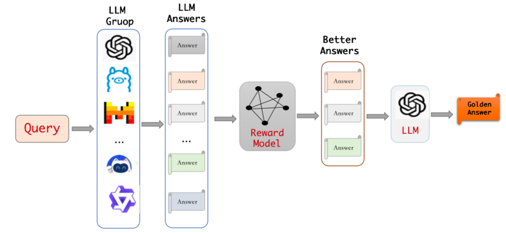
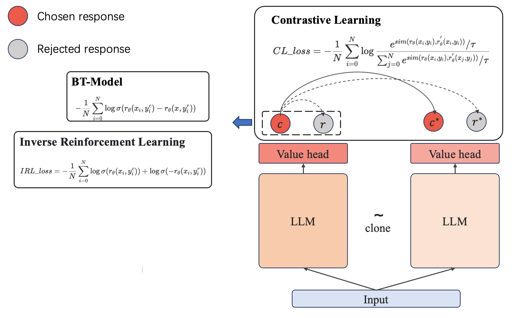
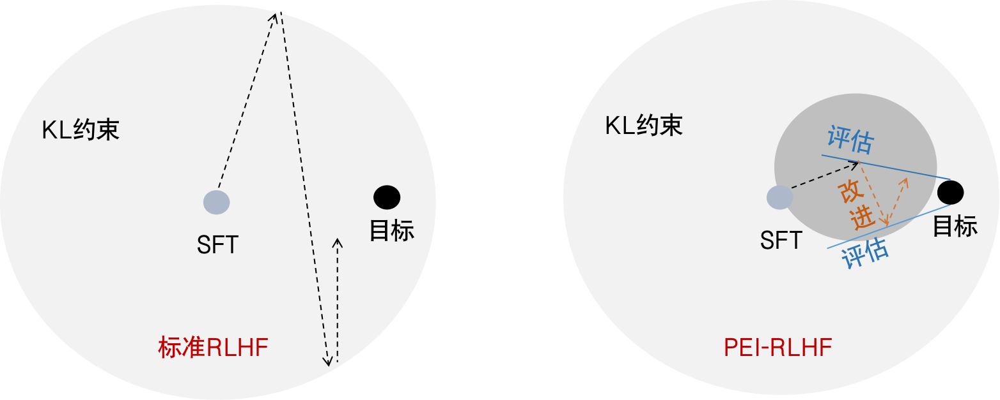
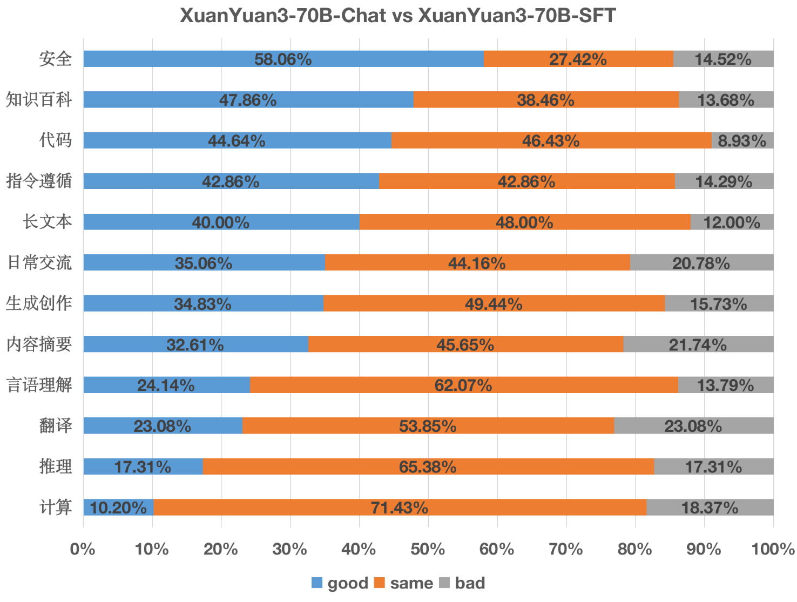
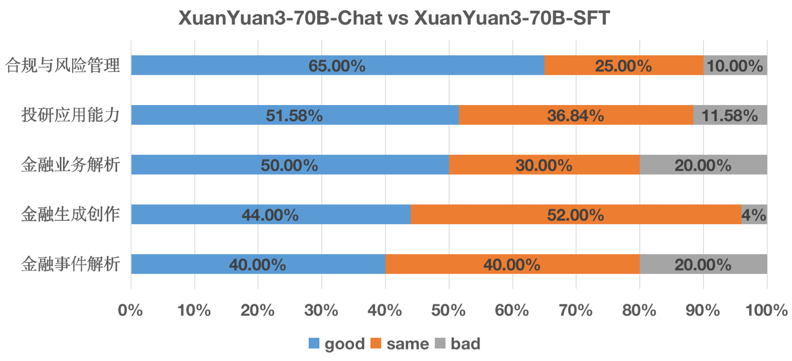

# XuanYuan3-70B

本次发布的XuanYuan3-70B-Chat模型以Llama3-70B模型为基础，采用大量中英文语料进行底座模型的增量预训练，并利用高质量指令数据和强化学习进行对齐训练。当前XuanYuan3-70B-Chat模型在各项金融评测任务上的总体表现超越了最新的中文开源模型，在金融场景中的任务评测中整体表现媲美GPT4o，并且在金融合规与风险管理、投研应用能力、金融业务解析、生成创作及事件解析等测量维度上超越GPT4o。XuanYuan3-70B-Chat模型整体沿用了XuanYuan2-70B系列模型的训练框架，本篇技术报告将主要介绍本次模型训练的采用的创新技术和改进细节。

## 一、增量预训练

鉴于Llama3-70B基座模型在训练过程中几乎未涉及中文数据，导致其中文能力相对薄弱。为此，我们首先对Llama3-70B基座模型使用大量高质量中文语料进行增量预训练（Continue Pre-training）。目前，这一过程的基本技术路线已相对完善，下面简要介绍我们在增量预训练过程的几个关键要点：

### 高效的分桶数据组织

我们沿用了先前自研的分桶训练方法[1]，对预训练数据采取启发式分桶处理。具体做法是将训练数据的长度动态地按照2k、4k、8k、16k等四种上下文长度进行拼接。 这种方法既能加快训练速度（大部分数据为2k），又能尽可能减少数据拼接的影响。值得注意的是，我们没有采用Llama3原文中使用的attention分割方法，主要出于以下考虑：

- 效率因素：使用变长的attention接口效率较低
- 优化拼接：我们的分桶方法能够尽可能降低数据拼接的情况

### 动态数据训练策略

我们的核心目标是在保持卓越的英文能力基础上，显著提升XuanYuan3的中文表现和金融专业水平。这一目标的实现关键在于增量预训练的多元数据类型的精准配比。在增量预训练过程中，我们采取以下动态调整方法：

- 细分数据类别：将训练数据精细划分为金融百科、新闻、社交媒体、专业学科等多个类别。

- 全面损失监控：不仅关注整体损失函数，还密切跟踪每个子类别数据的收敛情况。- 
- 实时动态调整：根据监控结果，逐步减少易学习类别的数据比例，同时增加难度较高类型的数据占比。
- 阶段性优化：整个训练过程中，我们分阶段动态调整数据配比，确保模型各方面能力的均衡提升。

通过这种精准、细粒度的训练策略，XuanYuan3在中文处理和金融领域理解方面取得了显著进步，同时保持了强大的英文能力。我们累积训练了275B语料。通过在困惑度（PPL）验证集和常规中英文指标上进行验证（包括Human、GSM8k、MMLU、CEVAL、CMMLU等），我们观察到模型性能基本稳定。最终模型在英文指标上基本维持不变（波动在±2%以内），而中文指标则有显著提升。

## 二、指令微调

基于先前增量预训练的基座模型，我们使用大量指令数据对模型进行指令微调训练。相较于 XuanYuan2，本次 XuanYuan3 在以下几个方面进行了进一优化。

### 金融领域细分的数据合成

XuanYuan3 继续深耕金融领域，我们根据实际应用场景将金融领域细分为几十个类别，涵盖理财、保险、信贷等多个大板块。对每个类别分别探索最优的合成数据方法，争取在每一个类别上均能得到质量最高的合成数据。我们在SFT阶段金融领域数据合成的一些关键方法和认知总结如下：

- 不同类别采取不同的数据合成方法，举例如下：

  - 金融知识类：我们采用自研的SelfQA[2]方法，让大模型基于积累的高质量的金融百科文档，自动产生高质量的金融百科指令数据，以确保金融知识的准确性，尽可能降低知识类的幻觉。

  - 金融常规问答类，我们借鉴Evol-Instruct的思想[3]，对历史积累的自有海量的金融问答数据，进行举一反三的扩展合成，产生更多样性更复杂的指令数据，能够涵盖各类的泛金融日常问答。

  - 金融分析类：该类别的特点是用户需要从大模型的输出中得到一些有效结论，比如对研报分析解读等。目前绝大部分大模型的输出都是泛泛解读，缺乏深刻的分析。 我们采取的方法是首先标注一批由多名金融专家撰写的解读分析类数据，之后让大模型参考上述结论对原问题进行重新输出，这样既可以得到一批质量高有深度，同时格式统一的种子数据。之后利用种子数据作为few-shot来利用合成新的分析类数据，这样得到的分析类数据质量普遍可以得到提升。

- 为了进一步的继续增强金融领域的合成数据质量，我们探索出一种**多模集成与金融Reward Model结合的指令数据提升的方法**，思路比较简单，如下图所示。

  - 我们针对同一条金融的query，同时调用多个大模型（开源/闭源/自研）同时产生多个回复。
  - 利用我们自研的金融Reward Model（UFRM，详情见下文），对所有回复打分，过滤低于阈值的回复。
  - 最后利用大模型对多个高质量的回复进行集成（相当于取长补短），得到最终的回复。

   **这种方法虽然推理成本提升，但是可以显著提升合成数据的质量，非常适合垂直领域数据的精益求精**。需要注意的是，在这个过程中，使用合适的Reward Model很关键，因为很多模型在垂直领域表现良莠不齐，因此需要Reward Model进行打分过滤。

    
     
    
        图1 多模集成的数据合成方法
    

 

### 动态SFT数据配比

延续增量预训练阶段的监控策略，在 SFT 阶段我们采取了以下措施：

- 细粒度loss监控：除总体loss外，还监控每个细分类别的loss,据此动态调整数据配比。

- 能力差异分析：观察到Llama3-70B基座模型在数学、代码方面表现强劲，而中文知识类数据收敛较慢。

- 动态数据配比调整: 每个epoch动态调整SFT数据配比，降低已收敛/过拟合类别占比，提升loss较高部分的数据占比。

通过精细化的领域细分、差异化的数据合成策略、创新的质量提升方法，以及动态优化的训练流程，XuanYuan3在金融垂直领域展现出强大的能力，同时通用能力也能够在同等参数量上展现出优势。

## 三、全能金融Reward Model: UFRM

Reward Model（RM）是RLHF的关键组件，传统RM主要针对模型回复的有用性、安全性进行评估，在此次XuanYuan3系列模型的训练过程中，我们创新的提出了UFRM（ <big>U</big>niversal <big>F</big>inancial <big>R</big>eward <big>M</big>odel）将金融能力的评估也纳入到了RM的能力范围之内。相较于XuanYuan2系列模型RM，UFRM能够同时在通用领域与金融领域实现对齐率的显著提升。
### 多样化的高质量偏好数据构建
偏好数据的质量决定着RM的效果，相较于XuanYuan2，XuanYuan3的偏好数据集主要有以下特点：
- 偏好数据prompt领域更加细分，金融相关偏好数据占比显著增加。为了完善UFRM的金融能力，我们广泛的收集了金融细分领域的prompt，涵盖金融基本认知、金融专业知识、金融知识问答、金融信息摘要、金融逻辑计算、金融业务分析、金融内容创作、金融合规、理财场景能力、金融客服对话等广泛的金融相关prompt。
- 偏好数据对的来源更加广泛。不同于XuanYuan2仅使用对应SFT模型构建偏好数据对的方式，我们使用了不同尺寸、不同采样设置的模型来构建偏好数据对，这样做的好处是使得RM的训练更加稳定且鲁棒。
- 优化数据训练流程。我们将构建的偏好数据划分为两个集合：预训练集合与微调集合。其中预训练集合以有用性、安全性集合为主。微调集合则以金融相关集合为主。

### 两阶段训练方法
UFRM的训练分为两个阶段：预训练与微调。
- 预训练阶段主要针对通用能力进行训练，数据规模相对较大。
- 微调阶段主要针对金融能力进行重点提升，该阶段训练数据相对较少，以高质量金融数据为主。 

在训练过程中，我们发现虽然第二阶段的微调训练以金融偏好数据为主，但这并不影响UFRM的通用领域的能力，相反的随着微调训练的进行，也能够带来UFRM通用能力的提升。

### 算法融合
为了进一步增强RM的学习能力，在常规Bradley-Terry (BT)模型的基础上我们创新性的引入了基于simcse的无监督对比学习和逆强化学习技术。

    
     
    
        图2 RM训练算法图
    

### RM评估
我们通过人工标注的方式构建了两个RM测评集合：金融集合与通用集合。其中金融集合主要针对RM金融领域相关对齐能力进行评估，而通用集合则针对除金融外的有用性、安全性等方面的对齐能力进行评估。具体子类别与模型对齐率如表格所示。

​    

<!-- 

|金融子类别|XuanYuan3-UFRM|XuanYuan2-RM
|----|----|----
投研应用能力:	|75.2%	|69.7%
合规与风险管理:	|80.2%	|72.9%
金融百科问答:	|70.5%	|69.3%
金融理解认知:	|56.0%	|41.9%
金融领域计算:	|59.9%	|54.7%
金融生成创作:	|68.5%	|59.5%
金融事件解析:	|69.1%	|68.6%
金融业务解析:	|69.8%	|67.0%
Average:	|68.7%	|62.9%

表1 金融集合对齐率

 -->

**金融集合对齐率**
| 通用子类别   | XuanYuan3-UFRM | XuanYuan2-RM |
|--------------|----------------|--------------|
| 内容摘要     | 50.4%          | 46.4%        |
| 日常交流     | 66.3%          | 64.9%        |
| 生成创作     | 61.1%          | 58.3%        |
| 推理         | 68.2%          | 58.0%        |
| 言语理解     | 61.0%          | 66.3%        |
| 知识百科     | 63.3%          | 59.0%        |
| 指令遵循     | 71.6%          | 66.2%        |
| 安全         | 64.5%          | 71.0%        |
| 代码能力     | 78.4%          | 62.2%        |
| 翻译能力     | 78.3%          | 75.0%        |
| 计算         | 57.5%          | 46.6%        |
| Average      | 65.5%          | 61.3%        |

<!-- ||投研应用能力|合规与风险管理|金融百科问答|金融理解认知|金融领域计算|金融生成创作|金融事件解析|金融业务解析|Average
|----|----|----|----|----|----|----|----|----|----
|XuanYuan2-RM|69.7%%|72.9%|69.3%|41.9%|54.7%|59.5%|68.6%|67.0%|62.9%
|XuanYuan3-UFRM|75.2%|80.2%|70.5%|56.0%|59.9%|68.5%|69.1%|69.8%|68.7% -->

**通用集合对齐率**

| 通用子类别   | XuanYuan3-UFRM | XuanYuan2-RM |
|--------------|----------------|--------------|
| 内容摘要     | 50.4%          | 46.4%        |
| 日常交流     | 66.3%          | 64.9%        |
| 生成创作     | 61.1%          | 58.3%        |
| 推理         | 68.2%          | 58.0%        |
| 言语理解     | 61.0%          | 66.3%        |
| 知识百科     | 63.3%          | 59.0%        |
| 指令遵循     | 71.6%          | 66.2%        |
| 安全         | 64.5%          | 71.0%        |
| 代码能力     | 78.4%          | 62.2%        |
| 翻译能力     | 78.3%          | 75.0%        |
| 计算         | 57.5%          | 46.6%        |
| Average      | 65.5%          | 61.3%        |

### 四、通用能力对齐：从RLHF到PEI-RLHF

众所周知，尽管RLHF在大模型对齐训练方面展示出极大的潜力[4]，但是其对训练技巧、超参设置的高度敏感性使得其优化方向难以控制，经常表现出较大的“对齐税”。基于上述原因，XuanYuan3-70B创新地提出了一种迭代式对齐训练的新范式，即“预训练-评估-改进”式人类反馈强化学习（Pre-training-Evaluation-Improvement Reinforcement learning with human feedback，PEI-RLHF）方法。如下图所示，标准的RLHF过程仅以KL散度作为约束来训练对齐目标，训练过程方差大，优化方向难以控制。而PEI-RLHF通过交替进行“评估”和“改进”步骤，有针对性地不断调整优化方向，提高探索效率，可以扬长避短，步步为营，更大程度地保留原有模型能力，同时提高模型与人类偏好的一致性。

    
     
    
        图3 左：标准RLHF流程，仅以KL作为约束优化对齐目标，稳定性差；右：PEI-RLHF流程，通过评估和改进两个过程不断迭代，稳定性高
    

#### PEI-RLHF迭代流程

具体来讲，PEI-RLHF的迭代式训练过程如下：

- **PPO预训练**：首先利用PPO算法对SFT模型进行对齐的预训练，该阶段和标准RLHF方法相同。我们使用较大的KL约束的权重，为后续训练提供稳定有效的起始点。
- **评估**：对PPO训练后的模型在保留的测试集上先后进行GPT评估和人工评估，并以每个子领域为单位统计模型训练增益，同时统计RM在每个子领域的对齐率。
- **改进**：将RM对齐率和模型评测结果按照“优”、“中”、“差”各自分成三档，对PPO训练效果进行归因分析，进而相应调整子领域的数据配比，开启改进阶段。改进阶段同样采用PPO训练，并逐步减小KL权重，释放模型约束，增加探索能力。

<!-- || **RM-优** | **RM-中** | **RM-差** |
|-----------|----------|----------|----------|
| **PPO-优** | —    | $\uparrow$  | —     |
| **PPO-中** | $\uparrow$ | —     | $\downarrow$ |
| **PPO-差** | $\uparrow \uparrow$     | $\downarrow$ | $\downarrow \downarrow$     | -->

重复进行评估和改进两个阶段，直至改进阶段数据配比不再发生变化或改进阶段无明显收益。通过PEI—RLHF方法逐步训练XuanYuan3-70B模型表现与人类偏好一致性，可以在训练过程中扬长避短，提高模型对齐效果。

#### 通用子领域全面提升

下图展示了PEI—RLHF方法在通用性的各细分子领域评估结果。可以看到：

- 经过PEI—RLHF训练的模型能够在11/12的通用子领域中优于或接近SFT模型的效果。
- 在安全性、知识百科和代码能力等子领域对齐训练后的模型表现显著好于SFT模型，且RM对齐率也较高，这与不断调整优化方向、提高探索能力“评估-改进”范式特性密不可分。
  

上述结果说明，经过PEI—RLHF方法训练后的XuanYuan3-70B模型可以在大多数子领域全面提升SFT模型的能力，相比标准RLHF有更小的对齐税。

    
     
    
        图4 PEI-RLHF方法在通用性的各细分子领域评估结果
    

### 五、金融能力对齐：置信区间过滤

作为金融领域模型，XuanYuan3-70B需要在金融领域展现出更强的专业能力，这和通用模型有着显著差异。以安全性为例，一般的模型对齐通常关注通用的安全回复能力，例如生成内容的侮辱性、政治敏感性等。然而，金融领域的安全性需求则更为复杂，如生成内容的合规性、金融数据泄露风险等。相比于通用数据，高质量的金融数据更为稀缺，且存在噪声、分布不均等问题，因此RM对应金融领域的判断能力通常更弱。有研究指出，打分不准确的RM会造成reward hacking等问题，严重影响PPO对齐训练的效果。针对该问题，我们引入了置信数据过滤技术，通过过滤掉RM打分不准确的数据对训练过程进行干预，从而提升模型在金融领域的专业能力。

#### 金融数据置信度建模
金融训练数据包括原始prompt，对应的子领域category和RM打分准确性$q_i$三个维度。因此，数据过滤主要考虑以下两个方面：

- **RM打分置信度**：RM的打分准确性是数据过滤的关键指标。然而，$q_i$是一个理论值，无法直接获得。尽管如此，已经有研究指出[5]，RM在过低或过高分段的评分置信度较低，因此RM分数可以近似表征对$q_i$的估计。
- **PPO可优化空间**：由于金融数据相对较少，SFT模型容易出现过拟合问题，导致在一些特定prompt上，即使为SFT模型设置采样参数，其生成的response也会过于“僵硬”，多次采样的结果相似度过高，难以为PPO提供有效的优化空间。

考虑到以上原因，我们首先调用SFT模型，为每个金融prompt采样生成n条response，并使用RM进行评分。进一步地，我们对数据进行如下操作：

- 删除RM评分的标准差小于指定阈值金融数据。
- 删除RM评分的均值高于或低于指定阈值金融。
- 根据RM评分的标准差对过滤后数据进行排序，在保持子领域比例的前提下通过标准差进行加权采样。

上述操作不仅能保证训练数据的多样性，还能确保RM评分的准确性，从而进一步提高RLHF的训练效果。

#### 金融专项能力大幅提高

下图展示了经过金融数据置信区间过滤的对齐训练后与SFT模型的对比结果。对比下图和表1可以看出：

<!-- 

 -->

<!-- 

    
     
    

      图5 基于置信区间过滤的金融领域对齐训练方法的评估结果
      

 -->

    
     
    
        图5 基于置信区间过滤的金融领域对齐训练方法的评估结果
    

- 在RM对齐率较高的子领域，如金融合规与风险管理、投研应用能力、金融业务解析、生成创作及事件解析等，对齐训练后的模型表现相比SFT模型有明显提高，净胜率均高于40%。
- 在金融合规与风险管理领域，进行置信区间过滤可以极大发挥PEI-RLHF优势，金融安全能力大幅提升，为金融大模型的落地应用提供了有效保障。
  

经过金融对齐训练后的模型可以在多个子领域提高金融专业能力，超过目前的开源甚至GPT4o等闭源模型，上述结果证明了置信区间过滤技术在提升模型金融专业能力方面有效性。

## 参考文献

1. Liu H, Peng Q, Yang Q, et al. Bucket Pre-training is All You Need[J]. arXiv preprint _arXiv:2407.07495_ (2024). 

2. Zhang X, Yang Q. Self-qa: Unsupervised knowledge guided language model alignment[J]. arXiv preprint _arXiv:2305.11952_  (2023).

3. Xu C, Sun Q, Zheng K, et al. Wizardlm: Empowering large language models to follow complex instructions[J]. arXiv preprint _arXiv:2304.12244_ (2023).

4. Ouyang, Long, et al. “Training language models to follow instructions with human feedback.” _Advances in Neural Information Processing Systems_ 35 (2022): 27730-27744.

5. Wang B, Zheng R, Chen L, et al. Secrets of rlhf in large language models part ii: Reward modeling[J]. arXiv preprint _arXiv:2401.06080_ (2024).